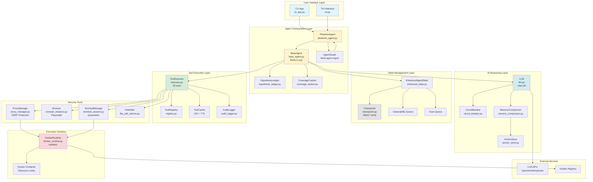
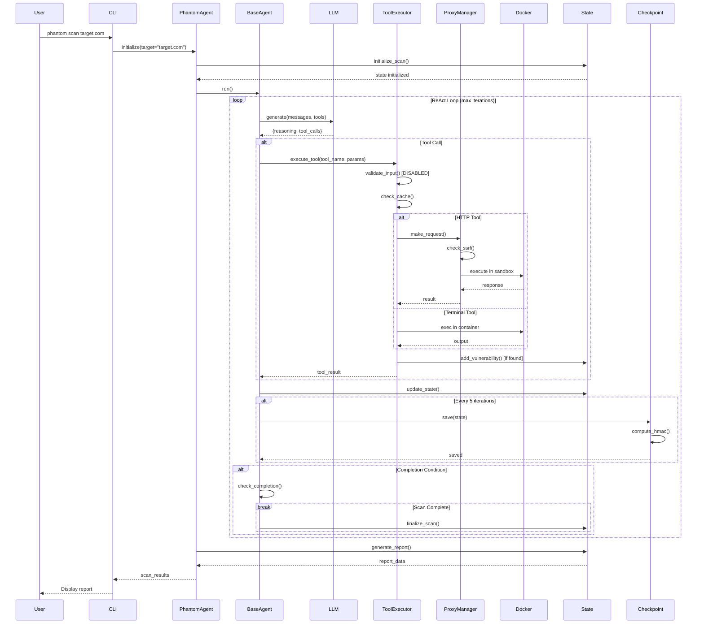
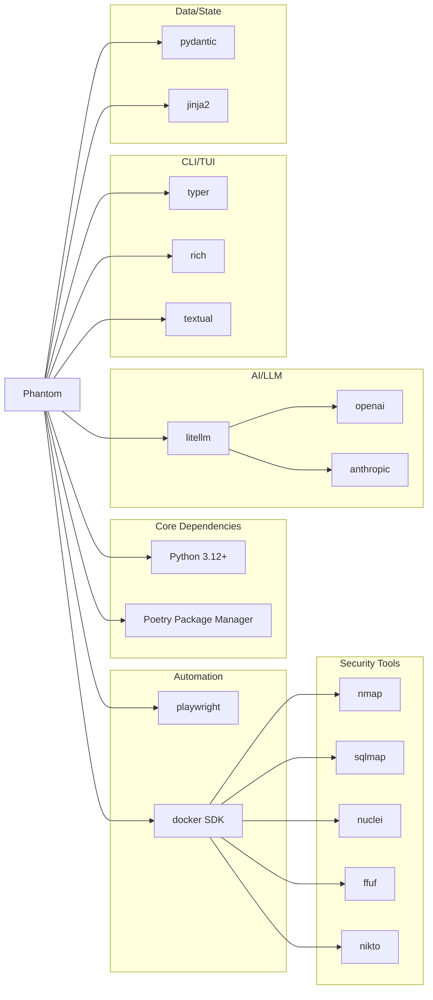

# PHANTOM AI AUTONOMOUS PENETRATION TESTING SYSTEM
# COMPREHENSIVE SECURITY AUDIT REPORT

---

**Audit Date:** April 4, 2026  
**System Version:** 0.9.131 (codebase) / 0.9.135 (pyproject.toml)  
**Auditor:** OpenCode AI Security Audit System  
**Audit Methodology:** Zero-tolerance production-grade security review per 14-point framework  
**Scope:** Full system architecture, autonomous AI logic, tooling, security controls, configuration

---

## AUDIT FRAMEWORK

This audit follows a rigorous 14-point assessment framework:

**PHASE 1: System Understanding**
1. System summary and purpose
2. Architecture overview
3. AI/Agent layer design
4. Tooling ecosystem
5. Scope control mechanisms
6. Autonomy model
7. State management
8. Reporting capabilities
9. Security controls
10. Dependencies

**PHASE 2: Structured Audit Report (Sections A-N)**
- A. System Summary
- B. Architecture Diagram
- C. Autonomous Loop Walkthrough
- D. AI Decision Logic Audit
- E. Tool Integration Audit
- F. Scope Control Audit
- G. State/Memory Audit
- H. Reporting Audit
- I. Security Audit
- J. Config Audit
- K. Dependency Audit
- L. Gaps & Missing Functionality
- M. Prioritized Findings
- N. Verification Test Plan

---

# SECTION A: SYSTEM SUMMARY

## A.1 System Identity

**Name:** Phantom  
**Version:** 0.9.131 (__init__.py) / 0.9.135 (pyproject.toml) **← VERSION MISMATCH DETECTED**  
**Purpose:** Autonomous AI-powered penetration testing and vulnerability assessment system  
**Repository:** https://github.com/Usta0x001/Phantom  
**License:** Apache-2.0  
**Language:** Python 3.12+  
**Status:** Beta (Development Status :: 4 - Beta)

## A.2 Core Capabilities

Phantom is a sophisticated autonomous offensive security intelligence platform that:

1. **Autonomous Pentesting**: Conducts vulnerability assessments without human intervention using ReAct (Reasoning + Acting) agent loop
2. **Multi-Agent Orchestration**: Spawns specialized sub-agents for parallel reconnaissance, exploitation, and analysis
3. **53 Security Tools**: Integrates industry-standard tools (Nmap, SQLMap, Nuclei, etc.) through unified executor
4. **33 Vulnerability Categories**: Organized skills covering OWASP Top 10, API security, infrastructure weaknesses
5. **Docker Sandbox Isolation**: Executes dangerous operations in isolated containers with resource limits
6. **LLM-Driven Decision Making**: Uses LiteLLM (OpenAI/Anthropic/etc.) for strategic reasoning and tool selection
7. **SSRF Protection**: Multi-layer defense against unintended network access
8. **Checkpoint/Resume**: HMAC-verified state persistence for long-running scans
9. **Interactive TUI**: Rich terminal interface with real-time progress visualization
10. **CLI Interface**: Headless mode for CI/CD integration

## A.3 High-Level Architecture

```
┌─────────────────────────────────────────────────────────────┐
│                      USER INTERFACE LAYER                    │
│  ┌─────────────────────┐      ┌─────────────────────┐       │
│  │   CLI (cli_app.py)  │      │    TUI (tui.py)     │       │
│  └──────────┬──────────┘      └──────────┬──────────┘       │
└─────────────┼──────────────────────────────┼────────────────┘
              │                              │
              └──────────────┬───────────────┘
                             ▼
┌─────────────────────────────────────────────────────────────┐
│                     AGENT ORCHESTRATION                      │
│  ┌──────────────────────────────────────────────────────┐   │
│  │         PhantomAgent (phantom_agent.py)              │   │
│  │   ┌────────────────────────────────────────────┐     │   │
│  │   │   BaseAgent (base_agent.py)                │     │   │
│  │   │   - ReAct loop (_loop method)              │     │   │
│  │   │   - Hypothesis ledger                      │     │   │
│  │   │   - Coverage tracker                       │     │   │
│  │   │   - Iteration management                   │     │   │
│  │   └────────────────────────────────────────────┘     │   │
│  └──────────────────────────────────────────────────────┘   │
│  ┌──────────────────────────────────────────────────────┐   │
│  │       AgentGraph (agent_graph.py)                    │   │
│  │   - Multi-agent spawning                             │   │
│  │   - Depth limits (MAX_AGENT_DEPTH)                   │   │
│  │   - Cascade-bomb prevention                          │   │
│  └──────────────────────────────────────────────────────┘   │
└─────────────┬───────────────────────────────┬───────────────┘
              │                               │
              ▼                               ▼
┌──────────────────────────┐    ┌────────────────────────────┐
│   LLM REASONING ENGINE   │    │    STATE MANAGEMENT        │
│  ┌────────────────────┐  │    │  ┌──────────────────────┐  │
│  │  llm.py (LLM)      │  │    │  │  enhanced_state.py   │  │
│  │  - LiteLLM         │  │    │  │  - Vuln queue        │  │
│  │  - Circuit breaker │  │    │  │  - Scan queue        │  │
│  │  - Budget control  │  │    │  │  - Findings ledger   │  │
│  └────────────────────┘  │    │  └──────────────────────┘  │
│  ┌────────────────────┐  │    │  ┌──────────────────────┐  │
│  │  memory_compressor │  │    │  │  checkpoint.py       │  │
│  │  - History mgmt    │  │    │  │  - HMAC verification │  │
│  │  - Anchor store    │  │    │  │  - Atomic saves      │  │
│  └────────────────────┘  │    │  └──────────────────────┘  │
└──────────────────────────┘    └────────────────────────────┘
              │
              ▼
┌─────────────────────────────────────────────────────────────┐
│                   TOOL EXECUTION LAYER                       │
│  ┌──────────────────────────────────────────────────────┐   │
│  │         ToolExecutor (executor.py)                   │   │
│  │   - 53 registered tools                              │   │
│  │   - Security validation (DISABLED PER USER REQUEST)  │   │
│  │   - Result caching (LRU, TTL)                        │   │
│  │   - Audit logging                                    │   │
│  └──────────────────────────────────────────────────────┘   │
│                                                              │
│  ┌─────────────┐  ┌─────────────┐  ┌──────────────────┐    │
│  │ Browser     │  │ ProxyMgr    │  │ Terminal         │    │
│  │ (Playwright)│  │ (SSRF prot) │  │ (Quarantine)     │    │
│  └─────────────┘  └─────────────┘  └──────────────────┘    │
└─────────────────────────────────────────────────────────────┘
              │
              ▼
┌─────────────────────────────────────────────────────────────┐
│                   EXECUTION SANDBOX                          │
│  ┌──────────────────────────────────────────────────────┐   │
│  │       DockerRuntime (docker_runtime.py)              │   │
│  │   - Memory limits (mem_limit)                        │   │
│  │   - CPU quotas (cpu_quota)                           │   │
│  │   - PID limits (pids_limit)                          │   │
│  │   - Capability dropping (SYS_ADMIN, SYS_PTRACE)      │   │
│  │   - Network isolation                                │   │
│  └──────────────────────────────────────────────────────┘   │
└─────────────────────────────────────────────────────────────┘
```

## A.4 Deployment Model

**Development:**
- Local Python execution with Poetry
- Docker Desktop for sandbox containers
- LLM API keys via environment variables

**Production:**
- Standalone CLI binary
- Docker-in-Docker for CI/CD
- RBAC controls (currently disabled: `PHANTOM_RBAC_ENABLED=false`)

## A.5 Key Stakeholders

**Primary Users:** Security researchers, penetration testers, red teams  
**Secondary Users:** DevSecOps engineers, security automation teams  
**Adversarial Model:** System must defend against:
- Prompt injection attacks from LLM outputs
- Command injection via malicious tool inputs
- SSRF attacks to internal infrastructure
- Resource exhaustion (memory/CPU bombs)
- Privilege escalation attempts

---

# SECTION B: ARCHITECTURE DIAGRAM

## B.1 System-Level Architecture (Mermaid)



## B.2 Data Flow Diagram: Scan Execution



## B.3 Component Dependency Map



---

