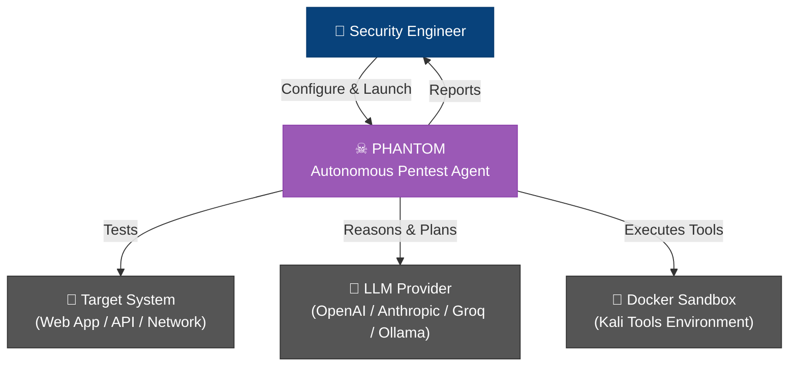
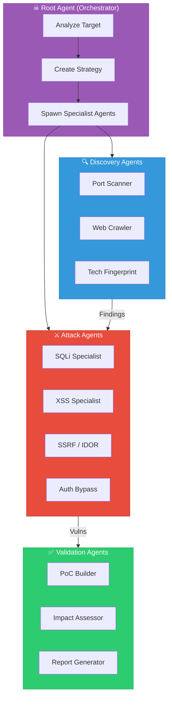
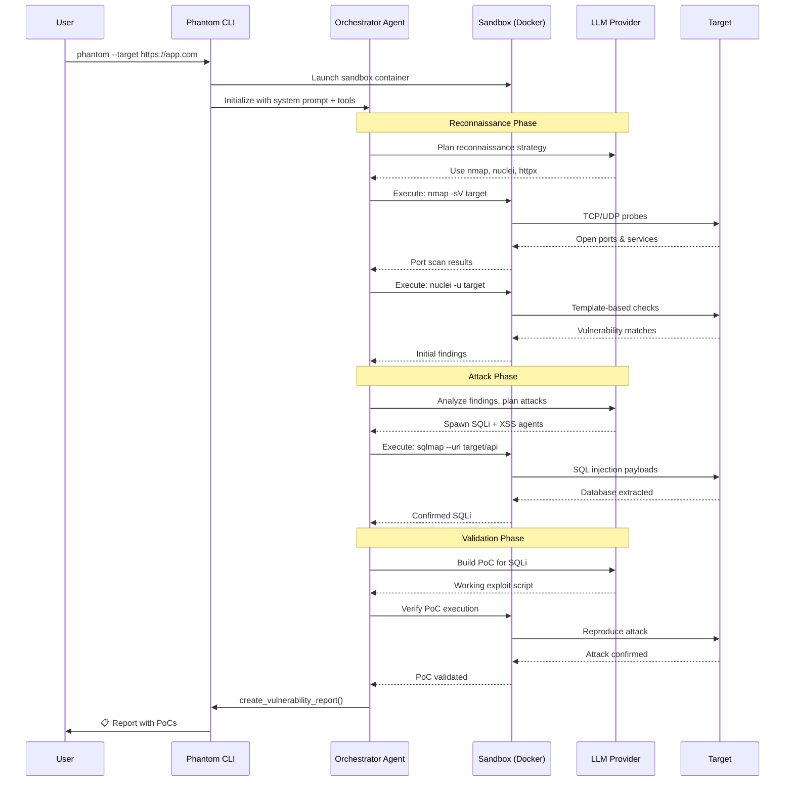
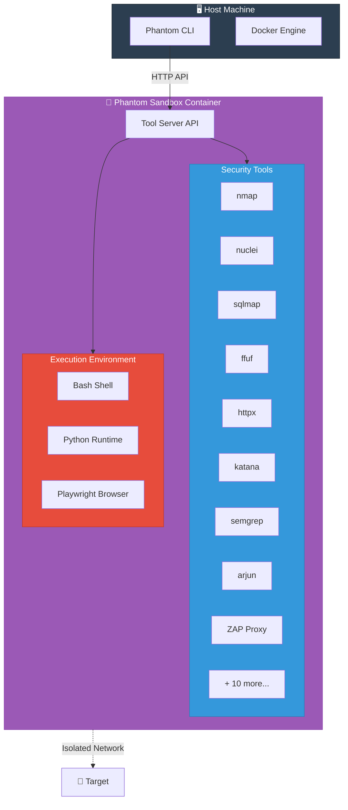
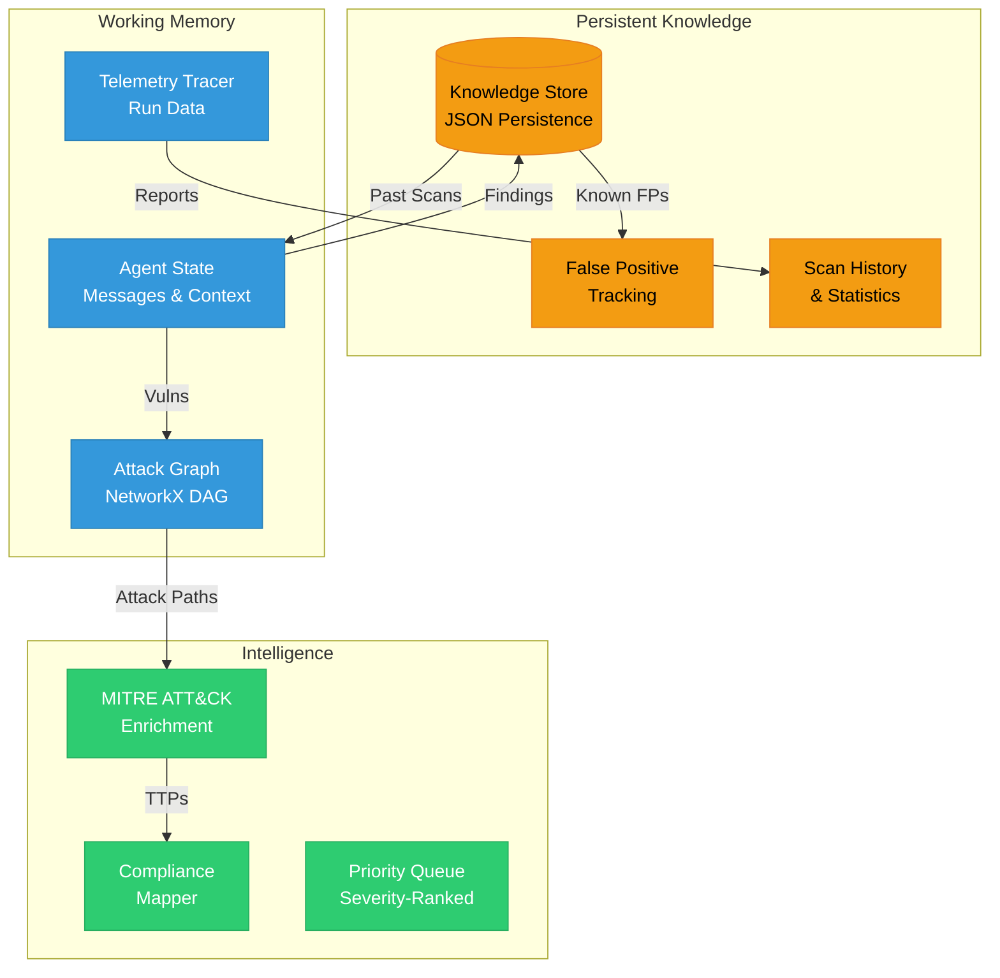
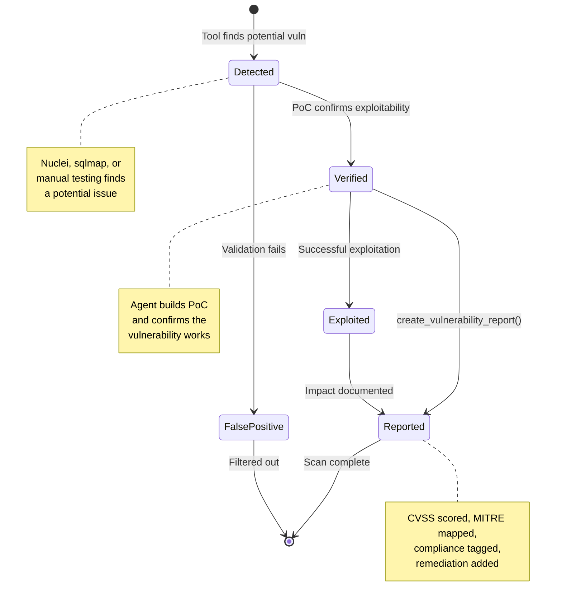

<div align="center">

# ☠ PHANTOM

### Autonomous Offensive Security Intelligence

* Why So Serious ?! *

<br>

[](LICENSE)
[](https://python.org)
[](https://hub.docker.com/r/usta0x001/phantom)
[](https://github.com/Usta0x001/Phantom/releases)

**AI-powered multi-agent penetration testing that thinks like a hacker.**

[Quick Start](#-quick-start) · [Features](#-features) · [Architecture](#-architecture) · [Documentation](#-documentation) · [Contributing](#-contributing)

</div>

---

## 📖 Table of Contents

- [Overview](#-overview)
- [Features](#-features)
- [Architecture](#-architecture)
- [Quick Start](#-quick-start)
- [Usage](#-usage)
- [Configuration](#-configuration)
- [CI/CD Integration](#-cicd-integration)
- [Development](#-development)
- [Documentation](#-documentation)
- [Contributing](#-contributing)
- [License](#-license)

## 🎯 Overview

Phantom deploys **autonomous AI agents** that act like expert penetration testers — they probe your systems dynamically, discover vulnerabilities, chain attack paths, and validate findings through real proof-of-concepts.

Unlike static scanners that just pattern-match, Phantom **thinks**: it reads responses, adapts strategy, exploits chained vulnerabilities, and proves every finding with working PoCs. No false positives. No manual triage.

> **Built for** security teams, bug bounty hunters, and developers who need fast, accurate offensive testing without the overhead of manual pentesting.

### Why Phantom?

| Traditional Scanners | **Phantom** |
|---|---|
| Pattern matching / signatures | AI reasoning + adaptive strategy |
| High false positive rate | Every finding validated with PoC |
| Single-pass scanning | Multi-agent collaboration & chaining |
| Generic reports | MITRE ATT&CK mapped + compliance ready |
| Manual triage needed | Actionable findings, remediation steps |

## ✨ Features

- 🤖 **Fully Autonomous** — AI agents that think, adapt, and act like real pentesters
- 🔬 **20+ Security Tools** — nmap, nuclei, sqlmap, ffuf, semgrep, katana, and more in a sandboxed Docker environment
- 🛡️ **Secure Sandbox** — All operations inside isolated Docker containers. Zero risk to your host
- 👥 **Multi-Agent System** — Specialized agent trees: discovery → exploitation → validation → reporting
- 🎯 **Real PoCs** — Every vulnerability comes with working proof-of-concept code
- 📊 **MITRE ATT&CK Mapping** — Findings automatically mapped to TTPs and techniques
- 📋 **Compliance Reports** — OWASP Top 10, PCI DSS, SOC 2 mapping out of the box
- 📦 **SARIF Output** — Native GitHub Security tab integration
- 🔄 **Differential Scanning** — Track new/fixed vulnerabilities across scan runs
- 🧠 **Knowledge Persistence** — Learns from past scans, avoids redundant work
- 🔔 **Notifications** — Webhook & Slack alerts on critical findings
- 🔌 **Plugin System** — Extend with custom tools and workflows
- ⚡ **Multiple LLM Providers** — OpenAI, Anthropic, Google, Groq, Ollama, and more via LiteLLM

## 🏗️ Architecture

### System Overview



### Agent Architecture



<details>
<summary><b>🔄 Scan Execution Flow</b> (click to expand)</summary>



</details>

<details>
<summary><b>🐳 Sandbox Architecture</b> (click to expand)</summary>



</details>

<details>
<summary><b>🧠 Knowledge & Memory System</b> (click to expand)</summary>



</details>

<details>
<summary><b>📊 Vulnerability Lifecycle</b> (click to expand)</summary>



</details>

## 🚀 Quick Start

### Prerequisites

- **Docker** (running) — [Install Docker](https://docs.docker.com/get-docker/)
- **Python 3.12+** — [Install Python](https://python.org)
- **An LLM API key** — [OpenAI](https://platform.openai.com/api-keys), [Anthropic](https://console.anthropic.com/), [Groq](https://console.groq.com/) (free), or any [LiteLLM provider](https://docs.litellm.ai/docs/providers)

### Install & Run

```bash
# Install via pip
pip install phantom-agent

# Or via pipx (recommended for CLI tools)
pipx install phantom-agent

# Configure your LLM provider
export PHANTOM_LLM="openai/gpt-4o"        # or groq/llama-3.3-70b-versatile (free!)
export LLM_API_KEY="your-api-key"

# Launch your first scan
phantom scan --target https://your-app.com
```

### Docker Quick Start

```bash
# Pull and run directly
docker run --rm -it \
  -e PHANTOM_LLM="openai/gpt-4o" \
  -e LLM_API_KEY="your-key" \
  -v /var/run/docker.sock:/var/run/docker.sock \
  usta0x001/phantom:latest \
  scan --target https://your-app.com
```

> [!NOTE]
> First run automatically pulls the sandbox image (~2GB). Scan results save to `phantom_runs/`.

## 📦 Usage

### Basic Scans

```bash
# Web application black-box scan
phantom scan --target https://your-app.com

# Quick scan (faster, less thorough)
phantom scan --target https://your-app.com --scan-mode quick

# Deep scan (comprehensive, slower)
phantom scan --target https://your-app.com --scan-mode deep

# Non-interactive / headless mode (for scripts & CI)
phantom scan --target https://your-app.com --non-interactive
```

### Advanced Testing

```bash
# Authenticated testing
phantom scan --target https://your-app.com \
  --instruction "Login with admin:password123 and test admin endpoints for IDOR"

# Focused vulnerability hunting
phantom scan --target https://api.your-app.com \
  --instruction "Focus on SQL injection and auth bypass in /api/v2 endpoints"

# Interactive TUI mode (rich terminal interface)
phantom --target https://your-app.com
```

### Scan Modes

| Mode | Speed | Coverage | Best For |
|------|-------|----------|----------|
| `quick` | ~10-20 min | Surface-level, common vulns | CI/CD gates, quick checks |
| `standard` | ~30-60 min | Balanced depth | Regular security testing |
| `deep` | ~1-3 hours | Full attack surface | Thorough pentests, audits |

## ⚙️ Configuration

### Environment Variables

| Variable | Description | Example |
|----------|-------------|---------|
| `PHANTOM_LLM` | LLM provider/model | `openai/gpt-4o` |
| `LLM_API_KEY` | API key(s), comma-separated for rotation | `sk-...` |
| `PHANTOM_REASONING_EFFORT` | Thinking depth: `low`, `medium`, `high` | `high` |
| `PHANTOM_SCAN_MODE` | Default scan mode | `standard` |
| `PERPLEXITY_API_KEY` | Enable web search OSINT | `pplx-...` |
| `PHANTOM_IMAGE` | Custom sandbox Docker image | `usta0x001/phantom-sandbox:latest` |
| `PHANTOM_WEBHOOK_URL` | Webhook for critical findings | `https://hooks.slack.com/...` |
| `PHANTOM_DISABLE_BROWSER` | Disable Playwright browser | `false` |

### Supported LLM Providers

| Provider | Model Example | Notes |
|----------|--------------|-------|
| **OpenAI** | `openai/gpt-4o` | Best overall |
| **Anthropic** | `anthropic/claude-sonnet-4-20250514` | Excellent reasoning |
| **Google** | `gemini/gemini-2.5-pro` | Large context |
| **Groq** | `groq/llama-3.3-70b-versatile` | **Free tier** |
| **Ollama** | `ollama/llama3.1` | Local, no API key |
| **DeepSeek** | `deepseek/deepseek-chat` | Cost-effective |
| **Azure** | `azure/gpt-4o` | Enterprise |
| **AWS Bedrock** | `bedrock/anthropic.claude-v2` | Enterprise |

> Phantom uses [LiteLLM](https://github.com/BerriAI/litellm) — any [supported provider](https://docs.litellm.ai/docs/providers) works out of the box.

### Persistent Configuration

```bash
# Save config so you don't re-enter it every time
phantom config set PHANTOM_LLM openai/gpt-4o
phantom config set LLM_API_KEY sk-your-key

# View current config
phantom config show
```

## 🔄 CI/CD Integration

### GitHub Actions

```yaml
name: Phantom Security Scan

on:
  pull_request:
    branches: [main]

jobs:
  security-scan:
    runs-on: ubuntu-latest
    steps:
      - uses: actions/checkout@v4

      - name: Install Phantom
        run: pip install phantom-agent

      - name: Run Security Scan
        env:
          PHANTOM_LLM: ${{ secrets.PHANTOM_LLM }}
          LLM_API_KEY: ${{ secrets.LLM_API_KEY }}
        run: phantom scan --target ./ --non-interactive --scan-mode quick

      - name: Upload SARIF
        if: always()
        uses: github/codeql-action/upload-sarif@v3
        with:
          sarif_file: phantom_runs/latest/results.sarif
```

## 🔧 Development

```bash
# Clone the repository
git clone https://github.com/Usta0x001/Phantom.git
cd Phantom

# Create virtual environment
python -m venv .venv
source .venv/bin/activate  # Linux/Mac
# .venv\Scripts\activate   # Windows

# Install dependencies
pip install -e ".[dev]"

# Run tests
pytest tests/ -v

# Lint
ruff check phantom/
```

### Project Structure

```
phantom/
├── phantom/                 # Core package
│   ├── agents/              # AI agent system
│   │   ├── PhantomAgent/    # Main agent + system prompt
│   │   ├── base_agent.py    # Agent base class
│   │   ├── state.py         # Thread-safe agent state
│   │   └── enhanced_state.py
│   ├── llm/                 # LLM integration
│   │   ├── llm.py           # Core LLM client
│   │   ├── provider_registry.py
│   │   └── memory_compressor.py
│   ├── core/                # Core modules
│   │   ├── scope_validator.py
│   │   ├── knowledge_store.py
│   │   ├── mitre_enrichment.py
│   │   ├── attack_graph.py
│   │   └── compliance_mapper.py
│   ├── tools/               # Security tool wrappers
│   ├── interface/           # CLI, TUI, reporting
│   ├── runtime/             # Docker sandbox management
│   ├── telemetry/           # Local-only run tracking
│   └── config/              # Configuration management
├── tests/                   # Test suite (90+ tests)
├── containers/              # Dockerfile for sandbox
├── scripts/                 # Install & build scripts
└── docs/                    # Documentation
```

## 📚 Documentation

| Topic | Description |
|-------|-------------|
| [Quick Start](#-quick-start) | Get scanning in 2 minutes |
| [Configuration](#-configuration) | All settings and providers |
| [Architecture](#-architecture) | How the agent system works |
| [CI/CD](#-cicd-integration) | GitHub Actions integration |
| [Contributing](#-contributing) | How to contribute |

## 🤝 Contributing

We welcome contributions! See our [Contributing Guide](CONTRIBUTING.md) for details.

- 🐛 **Bug Reports** — [Open an issue](https://github.com/Usta0x001/Phantom/issues)
- 💡 **Feature Requests** — [Start a discussion](https://github.com/Usta0x001/Phantom/discussions)
- 🔧 **Pull Requests** — Fork, branch, and submit a PR

## ⭐ Support

**Love Phantom?** Give us a ⭐ on [GitHub](https://github.com/Usta0x001/Phantom)!

## 📄 License

Apache License 2.0 — see [LICENSE](LICENSE) for details.

## 🙏 Acknowledgements

Phantom builds on incredible open-source projects:
[LiteLLM](https://github.com/BerriAI/litellm) · [Nuclei](https://github.com/projectdiscovery/nuclei) · [Playwright](https://github.com/microsoft/playwright) · [Textual](https://github.com/Textualize/textual) · [Rich](https://github.com/Textualize/rich) · [NetworkX](https://github.com/networkx/networkx)

---

<div align="center">

**☠ PHANTOM** · *" Why So Serious ?! "* · Autonomous Offensive Security Intelligence

Made with 🖤 by [Usta0x001](https://github.com/Usta0x001)

</div>

> [!WARNING]
> **Only test systems you own or have explicit authorization to test.** You are fully responsible for using Phantom ethically and legally. Unauthorized access to computer systems is illegal.
