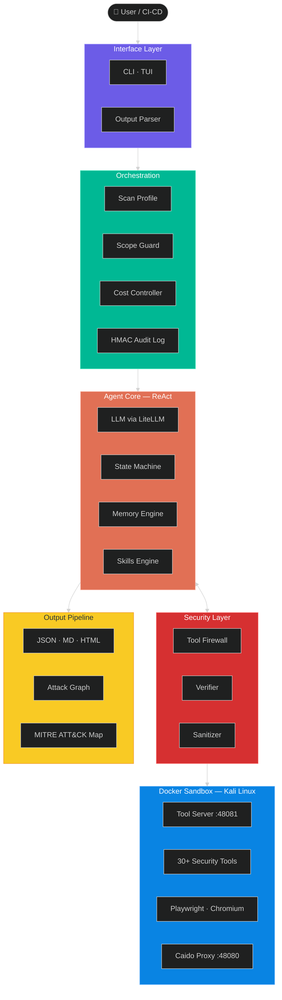
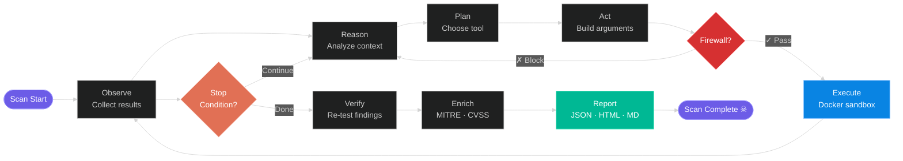
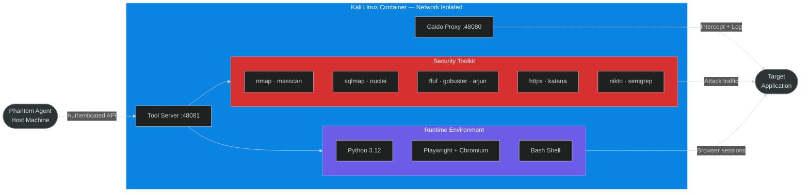
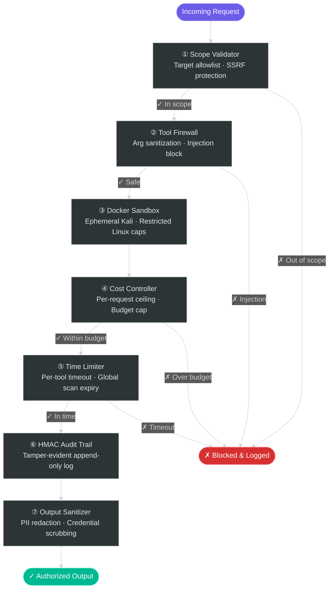

<div align="center">

<br/>

# ☠ PHANTOM

### Autonomous Adversary Simulation Platform

*AI-native penetration testing — autonomous reconnaissance, exploitation, and verified results.*

<br/>

[](https://pypi.org/project/phantom-agent/)
[](https://python.org)
[](LICENSE)
[](#architecture)
[](#tools)
[](#)
[](#quick-start)

<br/>

[**Quick Start**](#quick-start) &nbsp;·&nbsp; [**Architecture**](#architecture) &nbsp;·&nbsp; [**Usage**](#usage) &nbsp;·&nbsp; [**Configuration**](#configuration) &nbsp;·&nbsp; [**Contributing**](#contributing)

<br/>
</div>

---

## Overview

Phantom is an **autonomous AI penetration testing agent** built on the ReAct (Reason–Act) loop. It connects a large language model to over 30 professional security tools, runs all offensive operations inside an isolated Docker sandbox, and produces verified vulnerability reports — entirely without human intervention.

Unlike CVE-signature scanners, Phantom **reasons** about your target: it reads HTTP responses, forms hypotheses, selects the right tool, chains multi-step exploits, then writes and executes a proof-of-concept script to confirm every finding before it appears in a report.

| | Traditional Scanners | **Phantom** |
|--|--|--|
| **Approach** | Signature matching against CVE databases | LLM reasoning + adaptive tool chaining |
| **False Positives** | 40–70% — requires manual triage | Every finding verified with a working PoC |
| **Depth** | Single-pass HTTP probe | Multi-phase: recon → exploit → verify |
| **Adaptability** | Fixed rules, static payloads | Adapts to target responses in real time |
| **Novel Vulns** | Known CVEs only | Logic flaws + novel attack paths |
| **Reporting** | Generic vulnerability lists | MITRE ATT&CK mapped, compliance-ready |

---

## Core Capabilities

<table>
<tr>
<td align="center">🧠</td>
<td><strong>Autonomous ReAct Loop</strong> — Plans, executes tools, reads results, re-plans. Handles dead ends and unexpected responses without human guidance.</td>
</tr>
<tr>
<td align="center">🔧</td>
<td><strong>53 Security Tools</strong> — nmap · nuclei · sqlmap · ffuf · httpx · katana · subfinder · nikto · gobuster · arjun · semgrep · playwright — all orchestrated automatically.</td>
</tr>
<tr>
<td align="center">🐳</td>
<td><strong>Ephemeral Docker Sandbox</strong> — All offensive tooling runs in a network-restricted Kali Linux container. Zero host filesystem access. Container is destroyed after every scan.</td>
</tr>
<tr>
<td align="center">⚡</td>
<td><strong>Multi-Agent Parallelism</strong> — Spawns specialized sub-agents (SQLi, XSS, recon) that work concurrently and report findings to the coordinator.</td>
</tr>
<tr>
<td align="center">🛡️</td>
<td><strong>7-Layer Defense Model</strong> — Scope guard → Tool firewall → Docker sandbox → Cost limiter → Time budget → HMAC audit trail → Output sanitizer.</td>
</tr>
<tr>
<td align="center">✅</td>
<td><strong>Verified Findings Only</strong> — No hallucinations. Every reported vulnerability includes raw HTTP evidence, reproduction steps, and a working exploit script.</td>
</tr>
<tr>
<td align="center">🗺️</td>
<td><strong>MITRE ATT&CK Enrichment</strong> — Automatic CWE, CAPEC, technique-level tagging, and CVSS 3.1 scoring per finding.</td>
</tr>
<tr>
<td align="center">📋</td>
<td><strong>Compliance Coverage</strong> — OWASP Top 10 (2021) · PCI DSS v4.0 · NIST 800-53 — mapped automatically per finding.</td>
</tr>
<tr>
<td align="center">💾</td>
<td><strong>Knowledge Persistence</strong> — Cross-scan memory stores hosts, past findings, and false-positive signatures. Each scan learns from the last.</td>
</tr>
<tr>
<td align="center">💰</td>
<td><strong>Full Cost Control</strong> — Per-request and per-scan budget caps. Every token and every dollar tracked in real time.</td>
</tr>
</table>

---

## Architecture

<details open>
<summary><strong>① System Architecture — Component Overview</strong></summary>
<br/>


```mermaid
%%{init: {"theme": "dark"}}%%
flowchart TD
    USER(["👤 User / CI-CD"])

    subgraph IFACE["Interface Layer"]
        CLI["CLI · TUI"]
        PARSER["Output Parser"]
    end

    subgraph ORCH["Orchestration"]
        PROFILE["Scan Profile"]
        SCOPE["Scope Guard"]
        COST["Cost Controller"]
        AUDIT["HMAC Audit Log"]
    end

    subgraph AGENT["Agent Core — ReAct"]
        LLM["LLM via LiteLLM"]
        STATE["State Machine"]
        MEM["Memory Engine"]
        SKILLS["Skills Engine"]
    end

    subgraph SEC["Security Layer"]
        FW["Tool Firewall"]
        VERIFY["Verifier"]
        SANIT["Sanitizer"]
    end

    subgraph SANDBOX["Docker Sandbox — Kali Linux"]
        TSRV["Tool Server :48081"]
        TOOLS["30+ Security Tools"]
        BROWSER["Playwright · Chromium"]
        PROXY["Caido Proxy :48080"]
    end

    subgraph OUTPUT["Output Pipeline"]
        REPORTS["JSON · MD · HTML"]
        GRAPH["Attack Graph"]
        MITRE["MITRE ATT&CK Map"]
    end

    USER --> IFACE
    IFACE --> ORCH
    ORCH --> AGENT
    AGENT <--> SEC
    SEC --> SANDBOX
    AGENT --> OUTPUT

    style IFACE fill:#6c5ce7,stroke:#a29bfe,color:#ffffff
    style ORCH fill:#00b894,stroke:#55efc4,color:#ffffff
    style AGENT fill:#e17055,stroke:#fab1a0,color:#ffffff
    style SEC fill:#d63031,stroke:#ff7675,color:#ffffff
    style SANDBOX fill:#0984e3,stroke:#74b9ff,color:#ffffff
    style OUTPUT fill:#f9ca24,stroke:#f0932b,color:#2d3436
```

</details>

<details>
<summary><strong>② Scan Execution Flow — Phase by Phase</strong></summary>
<br/>

```mermaid
%%{init: {"theme": "dark"}}%%
sequenceDiagram
    actor User
    participant CLI as Phantom CLI
    participant Orch as Orchestrator
    participant Agent as Agent ReAct
    participant FW as Tool Firewall
    participant Box as Docker Sandbox
    participant LLM as LLM Provider
    participant T as Target App

    User->>CLI: phantom scan -t https://app.com
    CLI->>Orch: Validate scope · init cost controller
    Orch->>Box: Spin up ephemeral Kali container
    Orch->>Agent: Begin scan · profile + scope injected

    rect rgb(48, 25, 80)
        Note over Agent,LLM: Phase 1 — Reconnaissance
        Agent->>LLM: Analyze target · plan recon
        LLM-->>Agent: Run katana · httpx · nmap
        Agent->>FW: Validate tool call
        FW-->>Agent: Approved
        Agent->>Box: Execute recon tools
        Box->>T: HTTP probes · port scans · crawl
        T-->>Box: Responses
        Box-->>Agent: Endpoints · tech stack · open ports
    end

    rect rgb(80, 20, 20)
        Note over Agent,LLM: Phase 2 — Exploitation
        Agent->>LLM: Hypothesize attack vectors
        LLM-->>Agent: SQLi on /api/login · XSS on /search
        Agent->>Box: sqlmap · custom payload injection
        Box->>T: Exploit attempts
        T-->>Box: Vulnerability confirmed
        Box-->>Agent: Raw HTTP evidence
    end

    rect rgb(15, 60, 30)
        Note over Agent,LLM: Phase 3 — Verification
        Agent->>Box: Re-exploit with clean PoC script
        Box->>T: Reproduce exact attack
        T-->>Box: Confirmed
        Agent->>Agent: CVSS 3.1 · CWE tag · MITRE map
    end

    Agent->>CLI: Findings compiled
    CLI->>User: Vulnerabilities + PoCs + Compliance
    CLI->>Box: Destroy container
```

</details>

<details>
<summary><strong>③ Agent ReAct Loop — Decision Cycle</strong></summary>
<br/>


```mermaid
%%{init: {"theme": "dark"}}%%
flowchart LR
    INIT(["Scan Start"])

    OBS["Observe\nCollect results"]
    THINK["Reason\nAnalyze context"]
    PLAN["Plan\nChoose tool"]
    ACT["Act\nBuild arguments"]
    FW{"Firewall?"}
    EXEC["Execute\nDocker sandbox"]
    DONE{"Stop\nCondition?"}
    VERIFY["Verify\nRe-test findings"]
    ENRICH["Enrich\nMITRE · CVSS"]
    REPORT["Report\nJSON · HTML · MD"]
    FINISH(["Scan Complete ☠"])

    INIT --> OBS
    OBS --> THINK
    THINK --> PLAN
    PLAN --> ACT
    ACT --> FW
    FW -- "✓ Pass" --> EXEC
    FW -- "✗ Block" --> THINK
    EXEC --> OBS
    OBS --> DONE
    DONE -- "Continue" --> THINK
    DONE -- "Done" --> VERIFY
    VERIFY --> ENRICH
    ENRICH --> REPORT
    REPORT --> FINISH

    style INIT fill:#6c5ce7,stroke:#a29bfe,color:#fff
    style FINISH fill:#6c5ce7,stroke:#a29bfe,color:#fff
    style FW fill:#d63031,stroke:#ff7675,color:#fff
    style DONE fill:#e17055,stroke:#fab1a0,color:#fff
    style EXEC fill:#0984e3,stroke:#74b9ff,color:#fff
    style REPORT fill:#00b894,stroke:#55efc4,color:#fff
```

</details>

<details>
<summary><strong>④ Docker Sandbox — Isolation Architecture</strong></summary>
<br/>


```mermaid
%%{init: {"theme": "dark"}}%%
flowchart LR
    HOST(["Phantom Agent\nHost Machine"])

    subgraph CONTAINER["Kali Linux Container — Network Isolated"]
        TSRV["Tool Server :48081"]
        PROXY["Caido Proxy :48080"]

        subgraph TOOLKIT["Security Toolkit"]
            SCA["nmap · masscan"]
            INJ["sqlmap · nuclei"]
            FUZ["ffuf · gobuster · arjun"]
            WEB["httpx · katana"]
            ANA["nikto · semgrep"]
        end

        subgraph RUNTIME["Runtime Environment"]
            PY["Python 3.12"]
            BR["Playwright + Chromium"]
            SH["Bash Shell"]
        end
    end

    TARGET(["Target\nApplication"])

    HOST -- "Authenticated API" --> TSRV
    TSRV --> TOOLKIT
    TSRV --> RUNTIME
    PROXY -- "Intercept + Log" --> TARGET
    TOOLKIT -- "Attack traffic" --> TARGET
    RUNTIME -- "Browser sessions" --> TARGET

    style CONTAINER fill:#0984e3,stroke:#74b9ff,color:#ffffff
    style TOOLKIT fill:#d63031,stroke:#ff7675,color:#ffffff
    style RUNTIME fill:#6c5ce7,stroke:#a29bfe,color:#ffffff
    style HOST fill:#2d3436,stroke:#636e72,color:#dfe6e9
    style TARGET fill:#2d3436,stroke:#636e72,color:#dfe6e9
```

</details>

<details>
<summary><strong>⑤ 7-Layer Defense Model — Request Lifecycle</strong></summary>
<br/>


```mermaid
%%{init: {"theme": "dark"}}%%
flowchart TD
    REQ(["Incoming Request"])

    L1["① Scope Validator\nTarget allowlist · SSRF protection"]
    L2["② Tool Firewall\nArg sanitization · Injection block"]
    L3["③ Docker Sandbox\nEphemeral Kali · Restricted Linux caps"]
    L4["④ Cost Controller\nPer-request ceiling · Budget cap"]
    L5["⑤ Time Limiter\nPer-tool timeout · Global scan expiry"]
    L6["⑥ HMAC Audit Trail\nTamper-evident append-only log"]
    L7["⑦ Output Sanitizer\nPII redaction · Credential scrubbing"]

    PASS(["✓ Authorized Output"])
    BLOCK(["✗ Blocked & Logged"])

    REQ --> L1
    L1 -- "✓ In scope" --> L2
    L1 -- "✗ Out of scope" --> BLOCK
    L2 -- "✓ Safe" --> L3
    L2 -- "✗ Injection" --> BLOCK
    L3 --> L4
    L4 -- "✓ Within budget" --> L5
    L4 -- "✗ Over budget" --> BLOCK
    L5 -- "✓ In time" --> L6
    L5 -- "✗ Timeout" --> BLOCK
    L6 --> L7
    L7 --> PASS

    style REQ fill:#6c5ce7,stroke:#a29bfe,color:#fff
    style PASS fill:#00b894,stroke:#55efc4,color:#fff
    style BLOCK fill:#d63031,stroke:#ff7675,color:#fff
    style L1 fill:#2d3436,stroke:#636e72,color:#dfe6e9
    style L2 fill:#2d3436,stroke:#636e72,color:#dfe6e9
    style L3 fill:#2d3436,stroke:#636e72,color:#dfe6e9
    style L4 fill:#2d3436,stroke:#636e72,color:#dfe6e9
    style L5 fill:#2d3436,stroke:#636e72,color:#dfe6e9
    style L6 fill:#2d3436,stroke:#636e72,color:#dfe6e9
    style L7 fill:#2d3436,stroke:#636e72,color:#dfe6e9
```

</details>

---

## Quick Start

**Requirements:** Docker · Python 3.12+ · An LLM API key

```bash
# Install
pip install phantom-agent
# or for fully isolated install:
pipx install phantom-agent

# Set your LLM
export PHANTOM_LLM="openai/gpt-4o"     # any LiteLLM-supported model
export LLM_API_KEY="sk-..."

# Run your first scan
phantom -t https://your-app.com
```

> **First run** pulls the sandbox image (~13 GB). This happens once. Subsequent scans start in under 10 seconds.

### Via Docker

```bash
docker run --rm -it \
  -e PHANTOM_LLM="openai/gpt-4o" \
  -e LLM_API_KEY="your-key" \
  -v /var/run/docker.sock:/var/run/docker.sock \
  ghcr.io/usta0x001/phantom:latest \
  -t https://your-app.com
```

---

## Usage

```bash
# Quick scan (~15 min) — CI/CD friendly
phantom -t https://app.com -m quick

# Standard scan (~45 min) — recommended default
phantom -t https://app.com

# Deep scan (1–3 h) — exhaustive coverage
phantom -t https://app.com -m deep

# With custom focus instructions
phantom -t https://app.com \
  --instruction "Focus on SQL injection and broken auth in /api/v2"

# Resume an interrupted scan
phantom -t https://app.com

# Non-interactive (CI/CD pipelines)
phantom -t https://app.com --non-interactive

# Set a cost ceiling
PHANTOM_MAX_COST=2.00 phantom -t https://app.com
```

### Scan Profiles

| Profile | Max Iterations | Typical Duration | Best For |
|---------|:--------------:|:----------------:|----------|
| `quick` | 300 | ~15–60 min | CI/CD gates, rapid triage |
| `standard` | 120 | ~20–45 min | Regular security testing |
| `deep` | 300 | 1–3 hours | Full audits, compliance (default) |
| `stealth` | 60 | ~30–60 min | Covert assessments, WAF-aware targets |
| `api_only` | 100 | ~20–45 min | REST/GraphQL API-focused scans |

### Output

Every scan produces:

```
phantom_runs/<target>_<id>/
├── vulnerabilities/
│   ├── vuln-0001.md        # Full finding with PoC exploit
│   └── vuln-0002.md
├── audit.jsonl             # HMAC-signed immutable event log
├── scan_stats.json         # Cost, tokens, timing metrics
├── enhanced_state.json     # Full scan state snapshot
└── vulnerabilities.csv     # Summary index for triage
```

### Post-Scan Enrichment Pipeline

Every scan automatically runs a 7-stage enrichment pass:

| Stage | Action |
|-------|--------|
| 1. MITRE ATT&CK | CWE, CAPEC, technique-level tagging |
| 2. Compliance | OWASP Top 10 · PCI DSS v4 · NIST 800-53 |
| 3. Attack Graph | Dependency-based path analysis |
| 4. Nuclei Templates | Auto-generated YAML for regression testing |
| 5. Knowledge Store | Persistent cross-scan memory updated |
| 6. Notifications | Webhook / Slack alerts for critical findings |
| 7. Reports | JSON + HTML + Markdown output |

---

## CI/CD Integration

```yaml
# .github/workflows/security.yml
name: Security Scan

on:
  push:
    branches: [main]
  schedule:
    - cron: '0 2 * * 1'  # Weekly — Monday at 2 AM

jobs:
  phantom-scan:
    runs-on: ubuntu-latest
    steps:
      - name: Run Phantom
        run: |
          pip install phantom-agent
          phantom scan \
            --target ${{ vars.STAGING_URL }} \
            --scan-mode quick \
            --non-interactive \
            --output json
        env:
          PHANTOM_LLM: openai/gpt-4o
          LLM_API_KEY: ${{ secrets.LLM_API_KEY }}
          PHANTOM_MAX_COST: "1.00"
```

---

## Configuration

<details>
<summary><strong>Environment Variables</strong></summary>

| Variable | Description | Default |
|----------|-------------|---------|
| `PHANTOM_LLM` | LLM model (LiteLLM format) | `openai/gpt-4o` |
| `LLM_API_KEY` | API key — comma-separated for rotation | — |
| `PHANTOM_REASONING_EFFORT` | `low` / `medium` / `high` | `high` |
| `PHANTOM_SCAN_MODE` | Default scan profile | `standard` |
| `PHANTOM_IMAGE` | Sandbox Docker image | `ghcr.io/usta0x001/phantom-sandbox:latest` |
| `PHANTOM_MAX_COST` | Hard stop when total scan cost (USD) reaches this limit | — |
| `LLM_MAX_TOKENS` | Override max output tokens per LLM call (overrides scan-mode defaults: quick=4000, stealth=6000, default=8000) | — |
| `PHANTOM_WEBHOOK_URL` | Webhook URL for critical alerts | — |
| `PHANTOM_DISABLE_BROWSER` | Disable Playwright browser | `false` |
| `PHANTOM_TELEMETRY` | Enable anonymous usage telemetry | `false` |

</details>

<details>
<summary><strong>Supported LLM Providers</strong></summary>

Phantom uses [LiteLLM](https://github.com/BerriAI/litellm) — 100+ providers work out of the box:

| Provider | Example Model | Notes |
|----------|--------------|-------|
| **OpenAI** | `openai/gpt-4o` | Best overall quality |
| **Anthropic** | `anthropic/claude-opus-4-5` | Strong multi-step reasoning |
| **Google** | `gemini/gemini-2.5-pro` | Huge context window |
| **Groq** | `groq/llama-3.3-70b-versatile` | Free tier, very fast |
| **DeepSeek** | `deepseek/deepseek-chat` | Excellent cost efficiency |
| **OpenRouter** | `openrouter/deepseek/deepseek-v3.2` | Multi-provider routing |
| **Ollama** | `ollama/llama3.1` | Fully local — no API key required |
| **Azure OpenAI** | `azure/gpt-4o` | Enterprise deployments |

</details>

---

## Security Audit

Phantom has undergone extensive adversarial auditing across multiple versions:

| Severity | Identified | Fixed |
|----------|:----------:|:-----:|
| Critical | 8 | 8 |
| High | 19 | 19 |
| Medium | 34 | 34 |
| Low | 27 | 27 |
| **Total** | **88** | **88** |

All 88 identified issues are resolved. See [CHANGELOG.md](CHANGELOG.md) for the full history.

---

## Testing

```bash
# Run the full test suite
pytest tests/ -v

# With coverage report
pytest tests/ --cov=phantom --cov-report=html

# Run specific categories
pytest tests/ -m "security"
pytest tests/ -m "integration"
```

Current state: **150 tests passing · 0 failing · 689 skipped** (integration/e2e require live Docker)

---

## Documentation

| Resource | Description |
|----------|-------------|
| [Architecture](docs/ARCHITECTURE.md) | Deep-dive system design |
| [Documentation](docs/DOCUMENTATION.md) | Full API and configuration reference |
| [Contributing](CONTRIBUTING.md) | Development guidelines |
| [Changelog](CHANGELOG.md) | Version history and release notes |

---

## Docker Sandbox — Setup Guide

Phantom runs all offensive tools inside an isolated Docker sandbox container. This section covers setup for fresh installs and custom environments.

### Default Sandbox Image

The default image is `ghcr.io/usta0x001/phantom-sandbox:latest` — a pre-built Kali Linux container with all security tools installed.

**Requirements:**
- Docker Desktop or Docker Engine installed and running
- The image is pulled automatically on first scan (~13 GB, one-time download)

```bash
# Pre-pull the image manually (optional, avoids delay on first scan)
docker pull ghcr.io/usta0x001/phantom-sandbox:latest
```

### Using a Custom Sandbox Image

Override the image via environment variable or config:

```bash
# Environment variable
export PHANTOM_IMAGE="ghcr.io/usta0x001/phantom-sandbox:latest"
phantom -t https://target.com

# Or in ~/.phantom/config.yaml
phantom_image: "ghcr.io/usta0x001/phantom-sandbox:latest"
```

### Air-Gapped / Offline Environments

If your environment has no internet access:

```bash
# On a machine with internet access — save the image
docker pull ghcr.io/usta0x001/phantom-sandbox:latest
docker save ghcr.io/usta0x001/phantom-sandbox:latest | gzip > phantom-sandbox.tar.gz

# On the air-gapped machine — load it
docker load < phantom-sandbox.tar.gz

# Point Phantom at the loaded image
export PHANTOM_IMAGE="ghcr.io/usta0x001/phantom-sandbox:latest"
```

### Verify Sandbox Is Working

```bash
# Quick smoke test — should start a container and exit cleanly
docker run --rm ghcr.io/usta0x001/phantom-sandbox:latest nmap --version
docker run --rm ghcr.io/usta0x001/phantom-sandbox:latest nuclei --version
```

---

## Contributing

Contributions are welcome. See [CONTRIBUTING.md](CONTRIBUTING.md) for setup instructions.

- **Bugs** → [Open an issue](https://github.com/Usta0x001/Phantom/issues)
- **Features** → [Start a discussion](https://github.com/Usta0x001/Phantom/discussions)
- **PRs** → Fork · branch · test · submit

---

## License

Apache License 2.0 — see [LICENSE](LICENSE).

---

## Acknowledgements

Built on the shoulders of giants:

[LiteLLM](https://github.com/BerriAI/litellm) · [Nuclei](https://github.com/projectdiscovery/nuclei) · [SQLMap](https://github.com/sqlmapproject/sqlmap) · [Playwright](https://github.com/microsoft/playwright) · [Textual](https://github.com/Textualize/textual) · [Rich](https://github.com/Textualize/rich) · [ffuf](https://github.com/ffuf/ffuf) · [Subfinder](https://github.com/projectdiscovery/subfinder) · [Caido](https://caido.io)

---

<div align="center">

**☠ PHANTOM** &nbsp;—&nbsp; *Autonomous Adversary Simulation Platform*

[PyPI](https://pypi.org/project/phantom-agent/) &nbsp;·&nbsp; [GitHub](https://github.com/Usta0x001/Phantom) &nbsp;·&nbsp; [Issues](https://github.com/Usta0x001/Phantom/issues) &nbsp;·&nbsp; Made by [Usta0x001](https://github.com/Usta0x001)

<br/>

> **⚠ Legal Notice:** Only test systems you own or have explicit written authorization to test.
> Unauthorized access to computer systems is illegal. The authors assume no liability for misuse.

</div>
