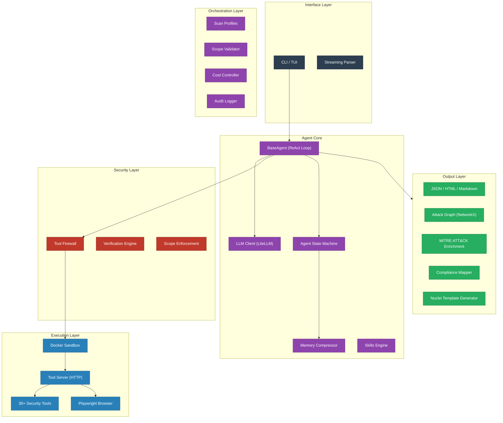
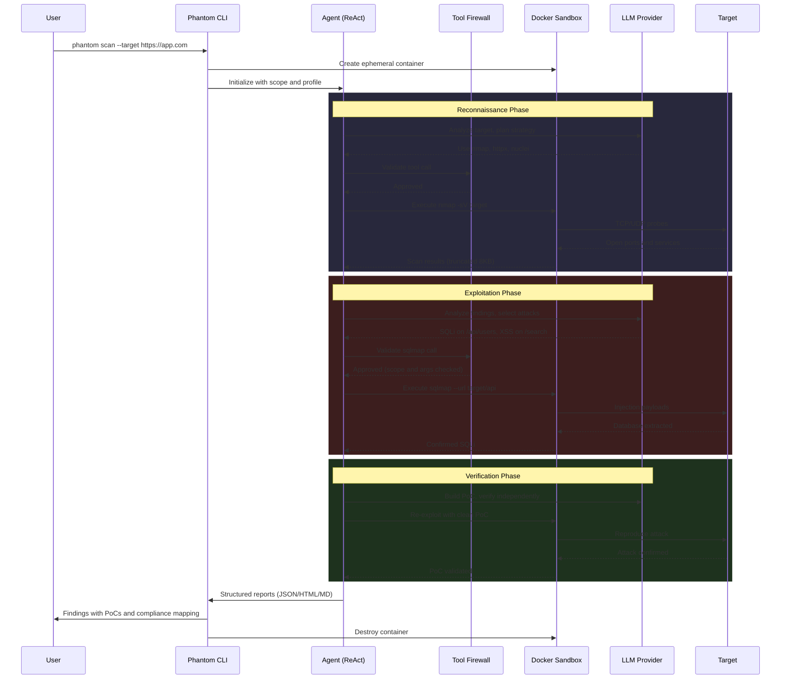
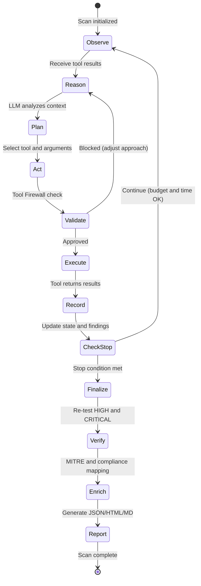
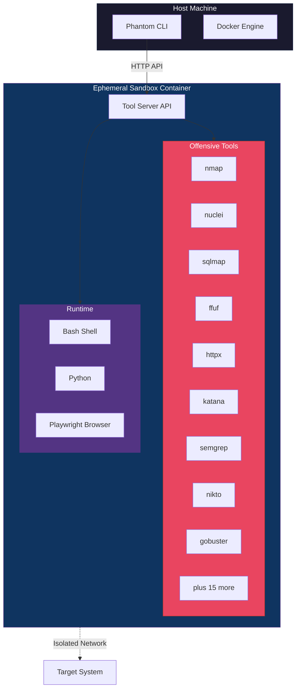
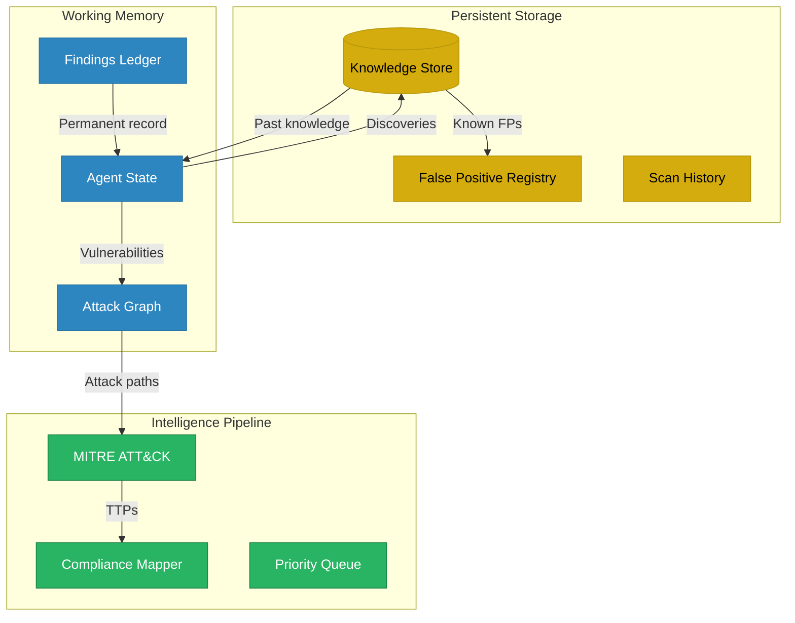
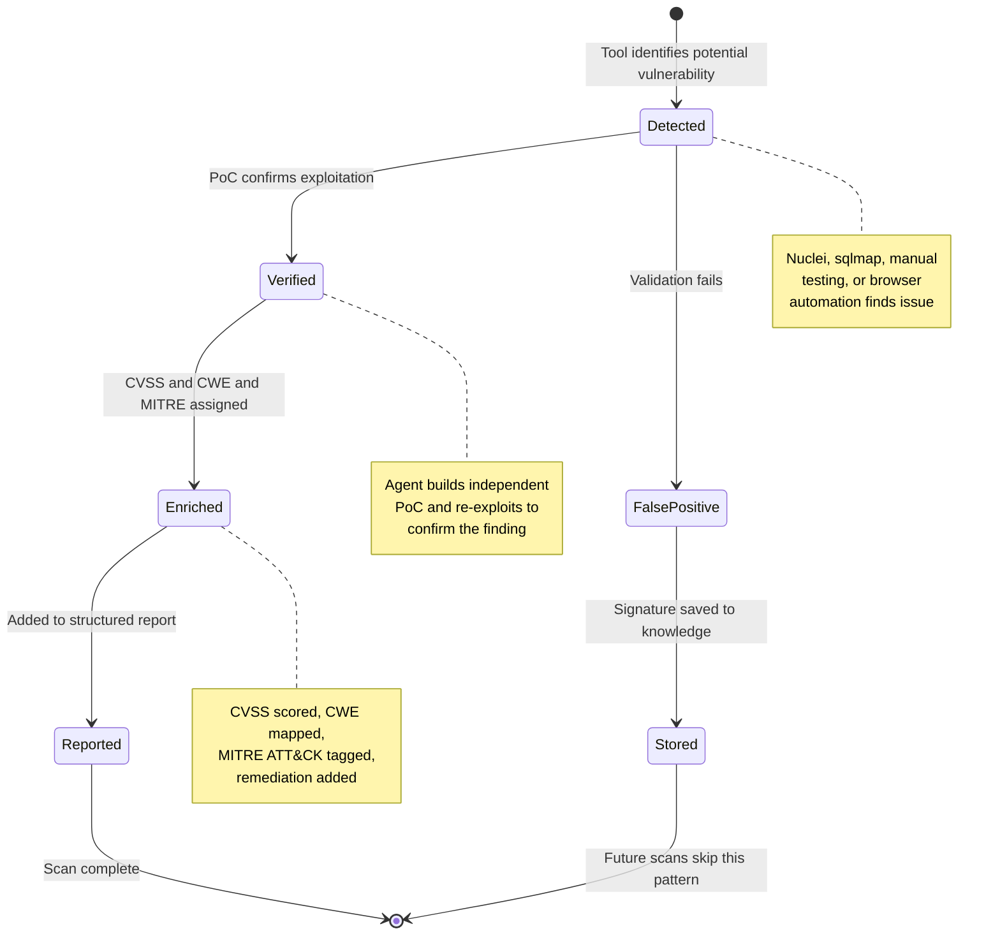

<div align="center">

# PHANTOM

### Autonomous Adversary Simulation Platform

<br>

[](LICENSE)
[](https://python.org)
[](https://hub.docker.com/r/redwan07/phantom)
[](https://pypi.org/project/phantom-agent/)
[](https://github.com/Usta0x001/Phantom/releases)
[](#testing--quality)

**AI-driven penetration testing that reasons, adapts, and verifies like a human attacker.**

[Quick Start](#quick-start) · [Features](#core-capabilities) · [Architecture](#system-architecture) · [Documentation](#documentation) · [Contributing](#contributing)

> **808+ tests passing** | **83-finding security audit resolved** | **7-layer defense-in-depth** | **30+ offensive tools**

</div>

---

## Table of Contents

- [Overview](#overview)
- [Core Capabilities](#core-capabilities)
- [System Architecture](#system-architecture)
- [Quick Start](#quick-start)
- [Usage](#usage)
- [Configuration](#configuration)
- [CI/CD Integration](#cicd-integration)
- [Development](#development)
- [Testing and Quality](#testing-and-quality)
- [Documentation](#documentation)
- [Contributing](#contributing)
- [License](#license)

## Overview

Phantom is an autonomous AI-powered penetration testing agent that discovers and verifies real vulnerabilities in web applications, APIs, and network services. It uses large language models to reason about targets, plan attack strategies, chain exploits, and adapt its approach based on observed behavior.

Unlike traditional scanners that rely on signatures and predefined rules, Phantom **thinks** — it reads responses, identifies attack surfaces, chains multi-step exploits, and produces proof-of-concept evidence for every confirmed vulnerability.

> **Built for** security professionals, red teams, and developers who need accurate offensive testing at scale.

### Traditional Scanners vs Phantom

| Traditional Scanners | Phantom |
|---|---|
| Signature and pattern matching | LLM-guided reasoning and adaptive strategy |
| High false positive rate | Every finding verified with working PoC |
| Single-pass scanning | Multi-phase attack with chained exploits |
| Generic scan reports | MITRE ATT&CK mapped, compliance-ready reports |
| Manual triage required | Actionable findings with remediation guidance |

## Core Capabilities

**Autonomous Operation** — AI agents plan, execute, and adapt penetration tests with zero human intervention. The ReAct (Reason + Act) loop drives iterative discovery and exploitation.

**30+ Security Tools** — nmap, nuclei, sqlmap, ffuf, httpx, katana, semgrep, nikto, gobuster, arjun, and more — all executing inside an isolated Docker sandbox.

**Sandboxed Execution** — All offensive tools run inside ephemeral Docker containers with no host filesystem access, restricted capabilities, and automatic cleanup.

**Multi-Agent System** — Specialized agent delegation for parallel reconnaissance, exploitation, and validation tasks.

**Real Proof-of-Concepts** — Every vulnerability includes working exploit code, raw request/response evidence, and reproducible steps.

**MITRE ATT&CK Mapping** — Automatic enrichment with CWE IDs, CAPEC attack patterns, and MITRE ATT&CK techniques.

**Compliance Reports** — OWASP Top 10, PCI DSS, NIST, SOC 2 mapping generated automatically.

**Browser Automation** — Full Playwright-based interaction for JavaScript-heavy applications, SPAs, and authenticated workflows.

**Knowledge Persistence** — Cross-scan memory stores discovered hosts, vulnerabilities, and false positive signatures. The agent learns from past scans.

**Scan Resume** — Checkpoint-based resume system lets you continue interrupted scans without data loss.

**Cost Tracking** — Per-request cost monitoring with configurable budget limits. Every token counted, every dollar tracked.

**7-Layer Security** — Scope validator, tool firewall, Docker sandbox, cost controller, time limits, HMAC audit trail, and output sanitizer.

## System Architecture

### High-Level Overview


```mermaid
flowchart TB
    classDef iface fill:#2c3e50,stroke:#1a252f,color:#fff
    classDef core fill:#8e44ad,stroke:#6c3483,color:#fff
    classDef security fill:#c0392b,stroke:#922b21,color:#fff
    classDef exec fill:#2980b9,stroke:#1f618d,color:#fff
    classDef output fill:#27ae60,stroke:#1e8449,color:#fff

    subgraph Interface["Interface Layer"]
        CLI["CLI / TUI"]
        Stream["Streaming Parser"]
    end

    subgraph Orchestration["Orchestration Layer"]
        Profile["Scan Profiles"]
        Scope["Scope Validator"]
        Cost["Cost Controller"]
        Audit["Audit Logger"]
    end

    subgraph AgentCore["Agent Core"]
        Agent["BaseAgent (ReAct Loop)"]
        State["Agent State Machine"]
        LLM["LLM Client (LiteLLM)"]
        Memory["Memory Compressor"]
        Skills["Skills Engine"]
    end

    subgraph Security["Security Layer"]
        Firewall["Tool Firewall"]
        Verifier["Verification Engine"]
        ScopeV["Scope Enforcement"]
    end

    subgraph Execution["Execution Layer"]
        Docker["Docker Sandbox"]
        ToolServer["Tool Server (HTTP)"]
        Tools["30+ Security Tools"]
        Browser["Playwright Browser"]
    end

    subgraph Output["Output Layer"]
        Reports["JSON / HTML / Markdown"]
        Graph["Attack Graph (NetworkX)"]
        MITRE["MITRE ATT&CK Enrichment"]
        Compliance["Compliance Mapper"]
        Nuclei["Nuclei Template Generator"]
    end

    CLI --> Agent
    Agent --> LLM
    Agent --> Firewall
    Firewall --> Docker
    Docker --> ToolServer
    ToolServer --> Tools
    ToolServer --> Browser
    Agent --> State
    State --> Memory
    Agent --> Output

    class CLI,Stream iface
    class Profile,Scope,Cost,Audit core
    class Agent,State,LLM,Memory,Skills core
    class Firewall,Verifier,ScopeV security
    class Docker,ToolServer,Tools,Browser exec
    class Reports,Graph,MITRE,Compliance,Nuclei output
```

### Scan Execution Flow


```mermaid
sequenceDiagram
    participant User
    participant CLI as Phantom CLI
    participant Agent as Agent (ReAct)
    participant Firewall as Tool Firewall
    participant Sandbox as Docker Sandbox
    participant LLM as LLM Provider
    participant Target

    User->>CLI: phantom scan --target https://app.com
    CLI->>Sandbox: Create ephemeral container
    CLI->>Agent: Initialize with scope and profile

    rect rgb(40, 40, 60)
        Note over Agent,LLM: Reconnaissance Phase
        Agent->>LLM: Analyze target, plan strategy
        LLM-->>Agent: Use nmap, httpx, nuclei
        Agent->>Firewall: Validate tool call
        Firewall-->>Agent: Approved
        Agent->>Sandbox: Execute nmap -sV target
        Sandbox->>Target: TCP/UDP probes
        Target-->>Sandbox: Open ports and services
        Sandbox-->>Agent: Scan results (truncated 8KB)
    end

    rect rgb(60, 30, 30)
        Note over Agent,LLM: Exploitation Phase
        Agent->>LLM: Analyze findings, select attacks
        LLM-->>Agent: SQLi on /api/users, XSS on /search
        Agent->>Firewall: Validate sqlmap call
        Firewall-->>Agent: Approved (scope and args checked)
        Agent->>Sandbox: Execute sqlmap --url target/api
        Sandbox->>Target: Injection payloads
        Target-->>Sandbox: Database extracted
        Sandbox-->>Agent: Confirmed SQLi
    end

    rect rgb(30, 50, 30)
        Note over Agent,LLM: Verification Phase
        Agent->>LLM: Build PoC, verify independently
        Agent->>Sandbox: Re-exploit with clean PoC
        Sandbox->>Target: Reproduce attack
        Target-->>Sandbox: Attack confirmed
        Sandbox-->>Agent: PoC validated
    end

    Agent->>CLI: Structured reports (JSON/HTML/MD)
    CLI->>User: Findings with PoCs and compliance mapping
    CLI->>Sandbox: Destroy container
```

### Agent Decision Loop


```mermaid
stateDiagram-v2
    [*] --> Observe: Scan initialized
    Observe --> Reason: Receive tool results
    Reason --> Plan: LLM analyzes context
    Plan --> Act: Select tool and arguments
    Act --> Validate: Tool Firewall check

    Validate --> Execute: Approved
    Validate --> Reason: Blocked (adjust approach)

    Execute --> Record: Tool returns results
    Record --> CheckStop: Update state and findings

    CheckStop --> Observe: Continue (budget and time OK)
    CheckStop --> Finalize: Stop condition met

    Finalize --> Verify: Re-test HIGH and CRITICAL
    Verify --> Enrich: MITRE and compliance mapping
    Enrich --> Report: Generate JSON/HTML/MD
    Report --> [*]: Scan complete
```

### Sandbox Architecture


```mermaid
graph TB
    subgraph Host["Host Machine"]
        CLI[Phantom CLI]
        DockerEngine[Docker Engine]
    end

    subgraph Container["Ephemeral Sandbox Container"]
        ToolServer[Tool Server API]

        subgraph OffensiveTools["Offensive Tools"]
            nmap[nmap]
            nuclei[nuclei]
            sqlmap[sqlmap]
            ffuf[ffuf]
            httpx[httpx]
            katana[katana]
            semgrep[semgrep]
            nikto[nikto]
            gobuster[gobuster]
            more[plus 15 more]
        end

        subgraph Runtime["Runtime"]
            Shell[Bash Shell]
            Python[Python]
            PW[Playwright Browser]
        end
    end

    CLI --> |HTTP API| ToolServer
    ToolServer --> OffensiveTools
    ToolServer --> Runtime
    Container -.-> |Isolated Network| Target["Target System"]

    style Host fill:#1a1a2e,stroke:#16213e,color:#fff
    style Container fill:#0f3460,stroke:#533483,color:#fff
    style OffensiveTools fill:#e94560,stroke:#c0392b,color:#fff
    style Runtime fill:#533483,stroke:#0f3460,color:#fff
```

<details>
<summary><b>Data Flow: Knowledge and Memory System</b> (expand)</summary>


```mermaid
graph TB
    subgraph Persistent["Persistent Storage"]
        KS[(Knowledge Store)]
        FP[False Positive Registry]
        History[Scan History]
    end

    subgraph Working["Working Memory"]
        State[Agent State]
        Ledger[Findings Ledger]
        Graph[Attack Graph]
    end

    subgraph Intelligence["Intelligence Pipeline"]
        MITRE[MITRE ATT&CK]
        Compliance[Compliance Mapper]
        Priority[Priority Queue]
    end

    State --> |Discoveries| KS
    KS --> |Past knowledge| State
    State --> |Vulnerabilities| Graph
    Graph --> |Attack paths| MITRE
    MITRE --> |TTPs| Compliance
    KS --> |Known FPs| FP
    Ledger --> |Permanent record| State

    classDef persist fill:#d4ac0d,stroke:#b7950b,color:#000
    classDef working fill:#2e86c1,stroke:#2874a6,color:#fff
    classDef intel fill:#28b463,stroke:#1e8449,color:#fff

    class KS,FP,History persist
    class State,Ledger,Graph working
    class MITRE,Compliance,Priority intel
```

</details>

<details>
<summary><b>Vulnerability Lifecycle</b> (expand)</summary>


```mermaid
stateDiagram-v2
    [*] --> Detected: Tool identifies potential vulnerability
    Detected --> Verified: PoC confirms exploitation
    Detected --> FalsePositive: Validation fails

    Verified --> Enriched: CVSS and CWE and MITRE assigned
    Enriched --> Reported: Added to structured report

    FalsePositive --> Stored: Signature saved to knowledge
    Stored --> [*]: Future scans skip this pattern

    Reported --> [*]: Scan complete

    note right of Detected
        Nuclei, sqlmap, manual
        testing, or browser
        automation finds issue
    end note

    note right of Verified
        Agent builds independent
        PoC and re-exploits to
        confirm the finding
    end note

    note right of Enriched
        CVSS scored, CWE mapped,
        MITRE ATT&CK tagged,
        remediation added
    end note
```

</details>

## Quick Start

### Prerequisites

- **Docker** (running) — [Install Docker](https://docs.docker.com/get-docker/)
- **Python 3.12+** — [Install Python](https://python.org)
- **LLM API key** — [OpenAI](https://platform.openai.com/api-keys), [Anthropic](https://console.anthropic.com/), [Groq](https://console.groq.com/) (free), or any [LiteLLM provider](https://docs.litellm.ai/docs/providers)

### Install and Run

```bash
# Install via pip
pip install phantom-agent

# Or via pipx (recommended for CLI tools)
pipx install phantom-agent

# Configure your LLM provider
export PHANTOM_LLM="openai/gpt-4o"
export LLM_API_KEY="your-api-key"

# Launch your first scan
phantom scan --target https://your-app.com
```

### Docker Quick Start

```bash
docker run --rm -it \
  -e PHANTOM_LLM="openai/gpt-4o" \
  -e LLM_API_KEY="your-key" \
  -v /var/run/docker.sock:/var/run/docker.sock \
  ghcr.io/usta0x001/phantom:latest \
  scan --target https://your-app.com
```

> **Note:** First run automatically pulls the sandbox image (~14GB Kali-based environment with 30+ security tools). Results are saved to `phantom_runs/`.

## Usage

### Basic Scans

```bash
# Standard web application scan
phantom scan --target https://your-app.com

# Quick scan (faster, surface-level)
phantom scan --target https://your-app.com --scan-mode quick

# Deep scan (comprehensive, thorough)
phantom scan --target https://your-app.com --scan-mode deep

# Headless mode (for scripts and CI)
phantom scan --target https://your-app.com --non-interactive
```

### Advanced Testing

```bash
# Authenticated testing
phantom scan --target https://your-app.com \
  --instruction "Login with admin:password123 and test admin endpoints for IDOR"

# Focused vulnerability hunting
phantom scan --target https://api.your-app.com \
  --instruction "Focus on SQL injection and auth bypass in /api/v2 endpoints"

# Interactive TUI mode
phantom --target https://your-app.com

# Resume an interrupted scan
phantom scan --target https://your-app.com --resume
```

### Scan Profiles

```bash
# View all available profiles
phantom profiles
```

| Profile | Iterations | Duration | Coverage | Best For |
|---------|:----------:|----------|----------|----------|
| `quick` | 20 | 10-20 min | Surface-level reconnaissance | CI/CD gates, quick checks |
| `standard` | 40 | 30-60 min | Balanced depth and speed | Regular security testing |
| `deep` | 80 | 1-3 hours | Full attack surface | Comprehensive audits |
| `stealth` | 30 | 20-40 min | Low-noise, no aggressive tools | Production systems |
| `api_only` | 40 | 30-60 min | API-focused, no browser | REST/GraphQL testing |

### Post-Scan Pipeline

Every scan automatically runs a 7-stage enrichment pipeline:

1. **MITRE ATT&CK** — CWE, CAPEC, and OWASP mapping for every finding
2. **Compliance** — OWASP Top 10, PCI DSS, NIST mapping
3. **Attack Graph** — NetworkX-based attack path analysis and visualization
4. **Nuclei Templates** — Auto-generated YAML templates for reproducibility
5. **Knowledge Store** — Cross-scan persistent memory updated with new findings
6. **Notifications** — Webhook/Slack alerts for critical and high severity findings
7. **Reports** — Structured JSON, HTML, and Markdown output

### Differential Scanning

```bash
# Compare two scan runs to see new and fixed vulnerabilities
phantom diff <run1> <run2>
```

## Configuration

### Environment Variables

| Variable | Description | Default |
|----------|-------------|---------|
| `PHANTOM_LLM` | LLM provider and model | `openai/gpt-4o` |
| `LLM_API_KEY` | API key (comma-separated for rotation) | — |
| `PHANTOM_REASONING_EFFORT` | Thinking depth: `low`, `medium`, `high` | `high` |
| `PHANTOM_SCAN_MODE` | Default scan profile | `standard` |
| `PHANTOM_IMAGE` | Custom sandbox Docker image | `ghcr.io/usta0x001/phantom-sandbox:latest` |
| `PHANTOM_MAX_COST` | Maximum cost per scan (USD) | `25.0` |
| `PHANTOM_PER_REQUEST_CEILING` | Max cost per LLM request (USD) | `5.0` |
| `PHANTOM_WEBHOOK_URL` | Webhook for critical findings | — |
| `PHANTOM_DISABLE_BROWSER` | Disable Playwright browser | `false` |
| `PERPLEXITY_API_KEY` | Enable web search OSINT | — |

### Supported LLM Providers

| Provider | Model Example | Notes |
|----------|--------------|-------|
| **OpenAI** | `openai/gpt-4o` | Best overall performance |
| **Anthropic** | `anthropic/claude-sonnet-4-20250514` | Strong reasoning |
| **Google** | `gemini/gemini-2.5-pro` | Large context window |
| **Groq** | `groq/llama-3.3-70b-versatile` | Free tier available |
| **DeepSeek** | `deepseek/deepseek-chat` | Cost-effective |
| **OpenRouter** | `openrouter/deepseek/deepseek-v3.2` | Multi-provider gateway |
| **Ollama** | `ollama/llama3.1` | Local inference, no API key |
| **Azure** | `azure/gpt-4o` | Enterprise deployments |

> Phantom uses [LiteLLM](https://github.com/BerriAI/litellm) — any of the [100+ supported providers](https://docs.litellm.ai/docs/providers) work out of the box.

### Persistent Configuration

```bash
# Save settings
phantom config set PHANTOM_LLM openai/gpt-4o
phantom config set LLM_API_KEY sk-your-key

# View current configuration
phantom config show
```

## CI/CD Integration

### GitHub Actions

```yaml
name: Security Scan

on:
  pull_request:
    branches: [main]

jobs:
  security-scan:
    runs-on: ubuntu-latest
    steps:
      - uses: actions/checkout@v4

      - name: Install Phantom
        run: pip install phantom-agent

      - name: Run Security Scan
        env:
          PHANTOM_LLM: ${{ secrets.PHANTOM_LLM }}
          LLM_API_KEY: ${{ secrets.LLM_API_KEY }}
        run: phantom scan --target ./ --non-interactive --scan-mode quick

      - name: Upload SARIF
        if: always()
        uses: github/codeql-action/upload-sarif@v3
        with:
          sarif_file: phantom_runs/latest/results.sarif
```

## Development

```bash
# Clone the repository
git clone https://github.com/Usta0x001/Phantom.git
cd Phantom

# Create virtual environment
python -m venv .venv
source .venv/bin/activate  # Linux/Mac
# .venv\Scripts\activate   # Windows

# Install with dev dependencies
pip install -e ".[dev]"

# Run the full test suite
pytest tests/ -v

# Lint
ruff check phantom/
```

### Project Structure

```
phantom/
    phantom/                 # Core package
        agents/              # AI agent system
            base_agent.py    # ReAct reasoning loop (859 lines)
            state.py         # Bounded state machine
            enhanced_state.py# Vulnerability tracking
        core/                # Security and reporting (20 modules)
            scope_validator.py
            tool_firewall.py
            audit_logger.py
            verification_engine.py
            report_generator.py
            knowledge_store.py
            attack_graph.py
            compliance_mapper.py
            mitre_enrichment.py
            nuclei_templates.py
        tools/               # 30+ security tool wrappers
        llm/                 # LLM client and memory compression
        runtime/             # Docker sandbox management
        interface/           # CLI, TUI, streaming
        models/              # Pydantic domain models
        skills/              # 50+ domain knowledge files
        telemetry/           # Run tracing and statistics
    tests/                   # 808+ tests
    containers/              # Sandbox Dockerfile
    scripts/                 # Build and install scripts
    docs/                    # Documentation
```

## Testing and Quality

808+ tests across 6 test suites with 0 failures:

| Suite | Tests | Scope |
|-------|:-----:|-------|
| `test_e2e_system.py` | 184 | Full system integration |
| `test_v0920_audit_fixes.py` | 39 | Security fix verification |
| `test_all_modules.py` | ~200 | Module-level unit tests |
| `test_v0918_features.py` | ~100 | Feature regression |
| `test_v0910_coverage.py` | ~80 | Coverage gap tests |
| `test_security_fixes.py` | ~50 | Security-specific tests |

### Security Audit

Two deep offensive audits performed on the codebase:

- **83 findings** identified (8 Critical, 19 High, 34 Medium, 22 Low)
- **All findings resolved** and verified with dedicated regression tests
- **System score:** 8.0/10 after full remediation cycle

## Documentation

| Document | Description |
|----------|-------------|
| [Architecture](docs/ARCHITECTURE.md) | System design and technical architecture |
| [Documentation](docs/DOCUMENTATION.md) | Complete system documentation v1 |
| [Quick Start](#quick-start) | Get scanning in 2 minutes |
| [Configuration](#configuration) | Settings, providers, and profiles |
| [Contributing](CONTRIBUTING.md) | Development guidelines |

## Contributing

Contributions are welcome. See the [Contributing Guide](CONTRIBUTING.md) for development setup and guidelines.

- **Bug Reports** — [Open an issue](https://github.com/Usta0x001/Phantom/issues)
- **Feature Requests** — [Start a discussion](https://github.com/Usta0x001/Phantom/discussions)
- **Pull Requests** — Fork, branch, test, and submit

## License

Apache License 2.0 — see [LICENSE](LICENSE) for details.

## Acknowledgements

Phantom builds on these open-source projects:
[LiteLLM](https://github.com/BerriAI/litellm) /
[Nuclei](https://github.com/projectdiscovery/nuclei) /
[Playwright](https://github.com/microsoft/playwright) /
[Textual](https://github.com/Textualize/textual) /
[Rich](https://github.com/Textualize/rich) /
[NetworkX](https://github.com/networkx/networkx)

---

<div align="center">

**PHANTOM** — Autonomous Adversary Simulation Platform

Made by [Usta0x001](https://github.com/Usta0x001)

</div>

> **WARNING:** Only test systems you own or have explicit written authorization to test. Unauthorized access to computer systems is illegal. You are fully responsible for ensuring legal and ethical use of this tool.
