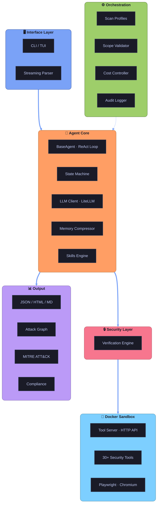
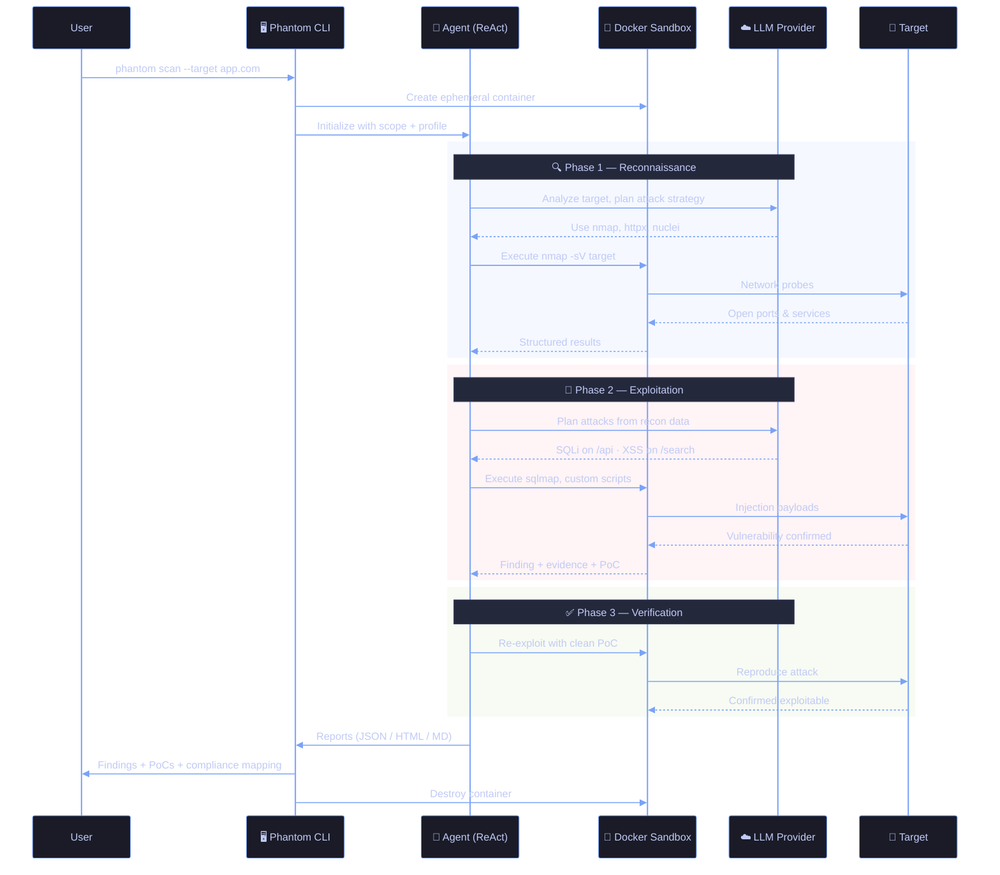
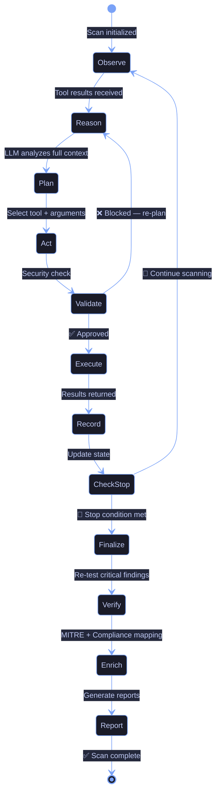
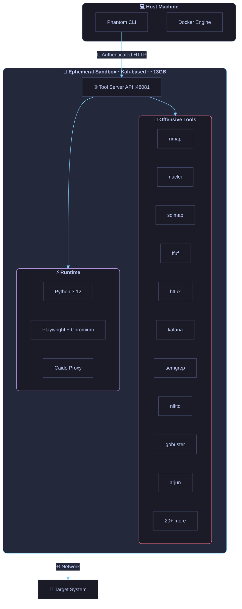

<div align="center">


# PHANTOM

### Autonomous Adversary Simulation Platform

> *Why so Serious!* — Phantom doesn't ask. It finds.

<br>

[](LICENSE)
[](https://python.org)
[](https://github.com/Usta0x001/Phantom/pkgs/container/phantom-sandbox)
[](https://pypi.org/project/phantom-agent/)
[](#testing)
[](#security-audit)

<br>

**AI-driven penetration testing that thinks, adapts, and verifies — like a senior red-teamer.**

[**Get Started**](#quick-start) &nbsp;·&nbsp; [**Architecture**](#architecture) &nbsp;·&nbsp; [**Usage**](#usage) &nbsp;·&nbsp; [**Docs**](#documentation) &nbsp;·&nbsp; [**Contributing**](#contributing)

</div>

<br>

---

## What is Phantom?

Phantom is an **autonomous AI penetration testing agent**. It uses large language models to discover and verify real vulnerabilities in web applications, APIs, and network services — with **zero human intervention**.

Unlike traditional scanners that match signatures, Phantom **reasons** about its target — it reads responses, identifies attack surfaces, chains multi-step exploits, and writes working proof-of-concept code for every finding it confirms.

<br>

<div align="center">

|  | Traditional Scanners | **Phantom** |
|:---:|:---:|:---:|
| 🧠 **Approach** | Signature matching | LLM-guided reasoning |
| ❌ **False Positives** | 40–70% typical | Every finding verified with working PoC |
| 🔍 **Depth** | Single-pass | Multi-phase with chained exploits |
| 📊 **Reports** | Generic CVE dumps | MITRE ATT&CK mapped · compliance-ready |
| ⚡ **Triage** | Manual review hours | Instant actionable findings + remediation |
| 💰 **Cost** | $449–$3,390/yr | **$0.36/scan** (open source) |

</div>

---

## Key Features

<table>
<tr>
<td width="50%">

### 🤖 Autonomous Operation
AI agents plan, execute, and adapt penetration tests through a **ReAct** (Reasoning + Acting) loop — no hand-holding required.

### 🛡️ Sandboxed Execution
All 30+ offensive tools run inside **ephemeral Docker containers** — no host filesystem access, restricted capabilities, automatic cleanup.

### ✅ Verified Findings
Every vulnerability includes a **working PoC exploit**, raw evidence, and reproducible steps. No guessing, no false positives.

### 🧠 Knowledge Persistence
Cross-scan memory stores hosts, vulnerabilities, and false-positive signatures. **The agent learns** from previous scans.

### 💰 Cost Tracking
Per-request and per-scan budget limits — every token counted, every dollar tracked.

</td>
<td width="50%">

### 🔧 30+ Security Tools
`nmap` · `nuclei` · `sqlmap` · `ffuf` · `httpx` · `katana` · `semgrep` · `nikto` · `gobuster` · `arjun` · `Playwright` and more.

### 🏗️ Multi-Agent System
Specialized sub-agents for parallel recon, exploitation and validation — the root agent orchestrates, sub-agents specialize.

### 🎯 MITRE ATT&CK Enrichment
Automatic **CWE**, **CAPEC**, and technique-level tagging with **CVSS 3.1** scoring on every finding.

### 📋 Compliance Mapping
**OWASP Top 10** (2021) · **PCI DSS v4.0** · **NIST 800-53** — mapped automatically per finding.

### 🔒 7-Layer Security Model
Scope validator · tool firewall · Docker sandbox · cost controller · time limits · HMAC audit trail · output sanitizer.

</td>
</tr>
</table>

---

---

## Architecture

<details open>
<summary><strong>🏛️ High-Level Architecture</strong></summary>

<br>


```mermaid
%%{init: {'theme': 'base', 'themeVariables': {'primaryColor': '#1a1b27', 'primaryTextColor': '#c0caf5', 'primaryBorderColor': '#414868', 'lineColor': '#7aa2f7', 'secondaryColor': '#24283b', 'tertiaryColor': '#1a1b27', 'fontSize': '14px'}}}%%
flowchart TB
    subgraph Interface["<b>🖥️ Interface Layer</b>"]
        direction LR
        CLI["CLI / TUI"]
        Stream["Streaming Parser"]
    end

    subgraph Orchestration["<b>⚙️ Orchestration</b>"]
        direction LR
        Profile["Scan Profiles"]
        Scope["Scope Validator"]
        Cost["Cost Controller"]
        Audit["Audit Logger"]
    end

    subgraph Agent["<b>🧠 Agent Core</b>"]
        direction LR
        ReAct["BaseAgent · ReAct Loop"]
        State["State Machine"]
        LLM["LLM Client · LiteLLM"]
        Memory["Memory Compressor"]
        Skills["Skills Engine"]
    end

    subgraph Security["<b>🔒 Security Layer</b>"]
        direction LR
        Verifier["Verification Engine"]
    end

    subgraph Execution["<b>🐳 Docker Sandbox</b>"]
        direction LR
        ToolServer["Tool Server · HTTP API"]
        Tools["30+ Security Tools"]
        Browser["Playwright · Chromium"]
    end

    subgraph Output["<b>📊 Output</b>"]
        direction LR
        Reports["JSON / HTML / MD"]
        Graph["Attack Graph"]
        MITRE["MITRE ATT&CK"]
        Compliance["Compliance"]
    end

    Interface ==> Agent
    Orchestration -.-> Agent
    Agent ==> Security
    Security ==> Execution
    Agent ==> Output

    style Interface fill:#7aa2f7,stroke:#3d59a1,color:#1a1b27,rx:10
    style Orchestration fill:#9ece6a,stroke:#56783e,color:#1a1b27,rx:10
    style Agent fill:#ff9e64,stroke:#b3713f,color:#1a1b27,rx:10
    style Security fill:#f7768e,stroke:#b35562,color:#1a1b27,rx:10
    style Execution fill:#7dcfff,stroke:#4d8faa,color:#1a1b27,rx:10
    style Output fill:#bb9af7,stroke:#7c6aaa,color:#1a1b27,rx:10
```

</details>

<details>
<summary><strong>🔄 Scan Execution Flow</strong></summary>

<br>


```mermaid
%%{init: {'theme': 'base', 'themeVariables': {'primaryColor': '#1a1b27', 'primaryTextColor': '#c0caf5', 'primaryBorderColor': '#414868', 'lineColor': '#7aa2f7', 'secondaryColor': '#24283b', 'tertiaryColor': '#1a1b27', 'fontSize': '13px', 'actorTextColor': '#c0caf5', 'actorBkg': '#1a1b27', 'actorBorder': '#7aa2f7', 'signalColor': '#7aa2f7', 'noteBkgColor': '#24283b', 'noteTextColor': '#c0caf5', 'noteBorderColor': '#414868'}}}%%
sequenceDiagram
    participant User
    participant CLI as 🖥️ Phantom CLI
    participant Agent as 🧠 Agent (ReAct)
    participant Sandbox as 🐳 Docker Sandbox
    participant LLM as ☁️ LLM Provider
    participant Target as 🎯 Target

    User->>CLI: phantom scan --target app.com
    CLI->>Sandbox: Create ephemeral container
    CLI->>Agent: Initialize with scope + profile

    rect rgba(122, 162, 247, 0.08)
        Note over Agent,LLM: 🔍 Phase 1 — Reconnaissance
        Agent->>LLM: Analyze target, plan attack strategy
        LLM-->>Agent: Use nmap, httpx, nuclei
        Agent->>Sandbox: Execute nmap -sV target
        Sandbox->>Target: Network probes
        Target-->>Sandbox: Open ports & services
        Sandbox-->>Agent: Structured results
    end

    rect rgba(247, 118, 142, 0.08)
        Note over Agent,LLM: 💉 Phase 2 — Exploitation
        Agent->>LLM: Plan attacks from recon data
        LLM-->>Agent: SQLi on /api · XSS on /search
        Agent->>Sandbox: Execute sqlmap, custom scripts
        Sandbox->>Target: Injection payloads
        Target-->>Sandbox: Vulnerability confirmed
        Sandbox-->>Agent: Finding + evidence + PoC
    end

    rect rgba(158, 206, 106, 0.08)
        Note over Agent,LLM: ✅ Phase 3 — Verification
        Agent->>Sandbox: Re-exploit with clean PoC
        Sandbox->>Target: Reproduce attack
        Target-->>Sandbox: Confirmed exploitable
    end

    Agent->>CLI: Reports (JSON / HTML / MD)
    CLI->>User: Findings + PoCs + compliance mapping
    CLI->>Sandbox: Destroy container
```

</details>

<details>
<summary><strong>🧠 Agent Decision Loop (ReAct)</strong></summary>

<br>


```mermaid
%%{init: {'theme': 'base', 'themeVariables': {'primaryColor': '#1a1b27', 'primaryTextColor': '#c0caf5', 'primaryBorderColor': '#7aa2f7', 'lineColor': '#7aa2f7', 'secondaryColor': '#24283b', 'tertiaryColor': '#1a1b27', 'fontSize': '13px'}}}%%
stateDiagram-v2
    [*] --> Observe: Scan initialized

    Observe --> Reason: Tool results received
    Reason --> Plan: LLM analyzes full context
    Plan --> Act: Select tool + arguments
    Act --> Validate: Security check

    Validate --> Execute: ✅ Approved
    Validate --> Reason: ❌ Blocked — re-plan

    Execute --> Record: Results returned
    Record --> CheckStop: Update state

    CheckStop --> Observe: 🔄 Continue scanning
    CheckStop --> Finalize: 🏁 Stop condition met

    Finalize --> Verify: Re-test critical findings
    Verify --> Enrich: MITRE + Compliance mapping
    Enrich --> Report: Generate reports
    Report --> [*]: ✅ Scan complete
```

</details>

<details>
<summary><strong>🐳 Sandbox Architecture</strong></summary>

<br>


```mermaid
%%{init: {'theme': 'base', 'themeVariables': {'primaryColor': '#1a1b27', 'primaryTextColor': '#c0caf5', 'primaryBorderColor': '#414868', 'lineColor': '#7dcfff', 'secondaryColor': '#24283b', 'tertiaryColor': '#1a1b27', 'fontSize': '13px'}}}%%
graph TB
    subgraph Host["<b>💻 Host Machine</b>"]
        CLI["Phantom CLI"]
        Docker["Docker Engine"]
    end

    subgraph Container["<b>🐳 Ephemeral Sandbox · Kali-based · ~13GB</b>"]
        ToolServer["🌐 Tool Server API :48081"]

        subgraph Toolkit["<b>🔧 Offensive Tools</b>"]
            direction LR
            nmap["nmap"] & nuclei["nuclei"] & sqlmap["sqlmap"] & ffuf["ffuf"]
            httpx["httpx"] & katana["katana"] & semgrep["semgrep"] & nikto["nikto"]
            gobuster["gobuster"] & arjun["arjun"] & more["20+ more"]
        end

        subgraph Runtime["<b>⚡ Runtime</b>"]
            direction LR
            Python["Python 3.12"]
            PW["Playwright + Chromium"]
            Caido["Caido Proxy"]
        end
    end

    CLI -->|"🔑 Authenticated HTTP"| ToolServer
    ToolServer --> Toolkit
    ToolServer --> Runtime
    Container -.->|"🌐 Network"| Target["🎯 Target System"]

    style Host fill:#1a1b27,stroke:#414868,color:#c0caf5,rx:10
    style Container fill:#24283b,stroke:#7dcfff,color:#c0caf5,rx:10
    style Toolkit fill:#1a1b27,stroke:#f7768e,color:#c0caf5,rx:8
    style Runtime fill:#1a1b27,stroke:#bb9af7,color:#c0caf5,rx:8
```

</details>

<details>
<summary><strong>🔒 7-Layer Security Model</strong></summary>

<br>

| Layer | Component | Protection |
|:---:|:---|:---|
| **1** | 🎯 **Scope Validator** | Target allowlist · SSRF protection · DNS pinning |
| **2** | 🧱 **Tool Firewall** | Argument validation · shell injection blocking |
| **3** | 🐳 **Docker Sandbox** | Ephemeral container · restricted capabilities |
| **4** | 💰 **Cost Controller** | Per-request ceiling ($5) · scan budget ($25) |
| **5** | ⏱️ **Time Limits** | Per-tool timeout · global scan timeout |
| **6** | 📝 **HMAC Audit Trail** | Tamper-evident · append-only event log |
| **7** | 🧹 **Output Sanitizer** | PII stripping · credential redaction |

</details>

---

---

## Quick Start

> **Requirements:** Docker (running) · Python 3.12+ · An LLM API key

### ⚡ Install & Run

```bash
# Install from PyPI
pip install phantom-agent

# Set your LLM provider
export PHANTOM_LLM="openrouter/deepseek/deepseek-v3.2"
export LLM_API_KEY="your-api-key"

# Launch your first scan
phantom scan --target https://your-app.com
```

> 📦 First run pulls the sandbox image (~13GB). All results are saved to `phantom_runs/`.

### 🐳 Docker (One-Liner)

```bash
docker run --rm -it \
  -e PHANTOM_LLM="openrouter/deepseek/deepseek-v3.2" \
  -e LLM_API_KEY="your-key" \
  -v /var/run/docker.sock:/var/run/docker.sock \
  ghcr.io/usta0x001/phantom:latest \
  scan --target https://your-app.com
```

---

---

## Usage

### 🎯 Scan Modes

```bash
# Quick scan (30–60 min, great for CI/CD)
phantom scan --target https://app.com --scan-mode quick

# Standard scan (20–45 min)
phantom scan --target https://app.com

# Deep scan (1–3 hours, exhaustive)
phantom scan --target https://app.com --scan-mode deep

# Stealth mode (30–60 min, low-noise, IDS/WAF evasion)
phantom scan --target https://app.com --scan-mode stealth

# API-only scan (20–45 min, REST/GraphQL, no browser)
phantom scan --target https://api.app.com --scan-mode api_only
```

### 🔧 Advanced Options

```bash
# Custom instructions
phantom scan --target https://app.com \
  --instruction "Focus on SQL injection in /api/v2 endpoints"

# Resume interrupted scan
phantom scan --target https://app.com --resume

# Interactive TUI
phantom --target https://app.com

# Non-interactive (CI/CD pipelines)
phantom scan --target https://app.com --non-interactive
```

### 📋 Scan Profiles

| Profile | Iterations | Duration | Best For |
|:--------|:----------:|:--------:|:---------|
| `quick` | 300 | 30–60 min | CI/CD · rapid checks |
| `standard` | 120 | 20–45 min | Regular testing |
| `deep` | 300 | 1–3 hours | Comprehensive audit |
| `stealth` | 60 | 30–60 min | Production · IDS evasion |
| `api_only` | 100 | 20–45 min | REST / GraphQL APIs |

### 🔄 Post-Scan Pipeline

Every scan automatically runs a **7-stage enrichment pipeline**:

> 1. **MITRE ATT&CK** — CWE · CAPEC · OWASP mapping
> 2. **Compliance** — OWASP Top 10 · PCI DSS v4 · NIST 800-53
> 3. **Attack Graph** — NetworkX path analysis
> 4. **Nuclei Templates** — Auto-generated YAML for regression
> 5. **Knowledge Store** — Persistent memory updated
> 6. **Notifications** — Webhook / Slack for critical findings
> 7. **Reports** — JSON · HTML · Markdown output

---

---

## Configuration

<details>
<summary><strong>⚙️ Environment Variables</strong></summary>

<br>

| Variable | Description | Default |
|:---------|:------------|:--------|
| `PHANTOM_LLM` | LLM model identifier | `openai/gpt-4o` |
| `LLM_API_KEY` | API key (comma-separated for rotation) | — |
| `PHANTOM_REASONING_EFFORT` | `low` · `medium` · `high` | `high` |
| `PHANTOM_SCAN_MODE` | Default scan profile | `standard` |
| `PHANTOM_IMAGE` | Sandbox Docker image | `ghcr.io/usta0x001/phantom-sandbox:latest` |
| `PHANTOM_MAX_COST` | Max cost per scan (USD) | `25.0` |
| `PHANTOM_PER_REQUEST_CEILING` | Max cost per LLM request | `5.0` |
| `PHANTOM_WEBHOOK_URL` | Webhook for critical findings | — |
| `PHANTOM_DISABLE_BROWSER` | Disable Playwright | `false` |

</details>

<details>
<summary><strong>☁️ Supported LLM Providers</strong></summary>

<br>

Phantom uses [LiteLLM](https://github.com/BerriAI/litellm) — **100+ providers** work out of the box:

| Provider | Model Example | Notes |
|:---------|:-------------|:------|
| **OpenRouter** | `openrouter/deepseek/deepseek-v3.2` | 🏆 Best cost-performance |
| **OpenAI** | `openai/gpt-4o` | Most reliable |
| **Anthropic** | `anthropic/claude-sonnet-4-20250514` | Best reasoning |
| **Google** | `gemini/gemini-2.5-flash` | 1M context window |
| **Groq** | `groq/llama-3.3-70b-versatile` | Free tier |
| **DeepSeek** | `deepseek/deepseek-chat` | Ultra cost-effective |
| **Ollama** | `ollama/llama3.1` | Local · air-gapped |
| **Azure** | `azure/gpt-4o` | Enterprise |

> 📖 See the full [LLM Selection Guide](docs/LLM_STUDY.md) for a detailed 35-model comparison.

</details>

---

---

## CI/CD Integration

<details>
<summary><strong>🔁 GitHub Actions</strong></summary>

<br>

```yaml
name: Security Scan
on:
  pull_request:
    branches: [main]

jobs:
  scan:
    runs-on: ubuntu-latest
    steps:
      - uses: actions/checkout@v4
      - run: pip install phantom-agent
      - run: phantom scan --target ./ --non-interactive --scan-mode quick
        env:
          PHANTOM_LLM: ${{ secrets.PHANTOM_LLM }}
          LLM_API_KEY: ${{ secrets.LLM_API_KEY }}
```

</details>

---

## Development

```bash
git clone https://github.com/Usta0x001/Phantom.git
cd Phantom
python -m venv .venv && source .venv/bin/activate  # .venv\Scripts\activate on Windows
pip install -e ".[dev]"
pytest tests/ -v
```

<details>
<summary><strong>📁 Project Structure</strong></summary>

<br>

```
phantom/
├── phantom/                  # Core package
│   ├── agents/               #   Agent system (ReAct loop, state, delegation)
│   ├── core/                 #   Security, reporting, knowledge (20+ modules)
│   ├── tools/                #   30+ security tool wrappers
│   ├── llm/                  #   LLM client, memory compression
│   ├── runtime/              #   Docker sandbox management
│   ├── interface/            #   CLI, TUI, streaming
│   ├── models/               #   Pydantic domain models
│   ├── skills/               #   Domain knowledge files
│   └── telemetry/            #   Run tracing
├── tests/                    # 731+ tests (0 failures)
├── containers/               # Sandbox Dockerfile
├── scripts/                  # Build scripts
└── docs/                     # Documentation + LLM study
```

</details>

---

## Testing

**731 tests · 0 failures · 97 skipped**

| Suite | Tests | Scope |
|:------|:-----:|:------|
| 🔗 Integration | 153 | Full system E2E |
| 🔒 Audit fixes | 39 | Security fix verification |
| 🧪 Unit tests | ~200 | Module-level |
| 🔁 Feature tests | ~100 | Regression |
| 📊 Coverage tests | ~80 | Gap coverage |
| 🛡️ Security tests | ~50 | Security-specific |

---

## Security Audit

Two deep offensive audits on the codebase — **all findings resolved**:

| Severity | Found | Fixed | Status |
|:---------|:-----:|:-----:|:------:|
| 🔴 Critical | 8 | 8 | ✅ |
| 🟠 High | 19 | 19 | ✅ |
| 🟡 Medium | 34 | 34 | ✅ |
| 🟢 Low | 22 | 22 | ✅ |
| **Total** | **83** | **83** | **✅ 100%** |

---

## Documentation

| Document | Description |
|:---------|:------------|
| 📐 [Architecture](docs/ARCHITECTURE.md) | System design & component overview |
| 📖 [Full Documentation](docs/DOCUMENTATION.md) | Complete reference guide |
| ⚡ [Quick Start](QUICKSTART.md) | Get scanning in 2 minutes |
| 🤖 [LLM Selection Guide](docs/LLM_STUDY.md) | 35-model comparison & benchmarks |
| 🤝 [Contributing](CONTRIBUTING.md) | Development guidelines |

---

## Contributing

Contributions welcome! See [CONTRIBUTING.md](CONTRIBUTING.md).

- 🐛 **Bugs** — [Open an issue](https://github.com/Usta0x001/Phantom/issues)
- 💡 **Features** — [Start a discussion](https://github.com/Usta0x001/Phantom/discussions)
- 🔀 **PRs** — Fork · branch · test · submit

---

## License

Apache License 2.0 — see [LICENSE](LICENSE).

---

## Acknowledgements

Built on: [LiteLLM](https://github.com/BerriAI/litellm) · [Nuclei](https://github.com/projectdiscovery/nuclei) · [Playwright](https://github.com/microsoft/playwright) · [Textual](https://github.com/Textualize/textual) · [Rich](https://github.com/Textualize/rich) · [NetworkX](https://github.com/networkx/networkx) · [SQLMap](https://github.com/sqlmapproject/sqlmap)

---

<div align="center">

**PHANTOM** — *"Why so Serious!"*

Made with ⚡ by [Usta0x001](https://github.com/Usta0x001)

</div>

> ⚠️ **WARNING:** Only test systems you own or have explicit written authorization to test. Unauthorized access to computer systems is illegal.
