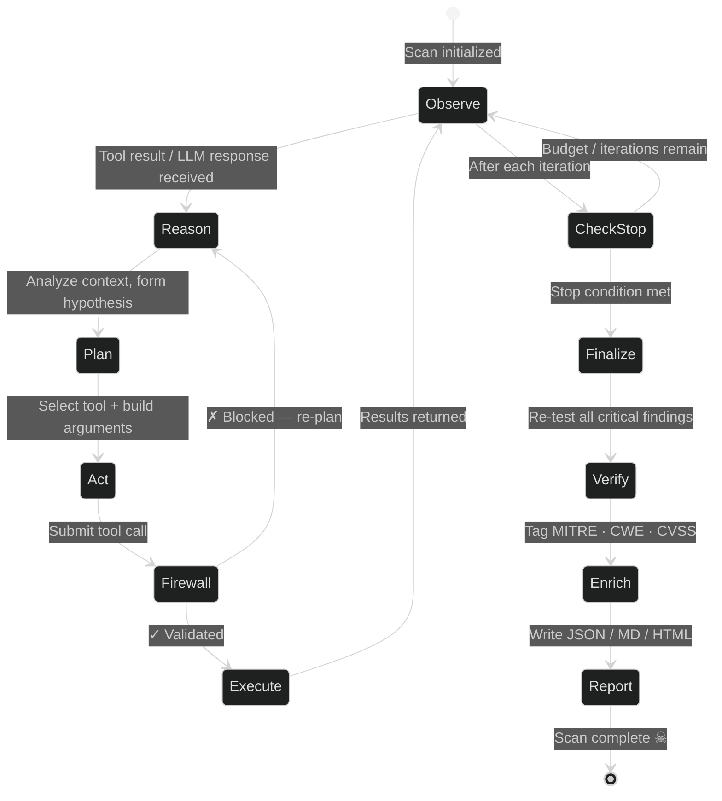
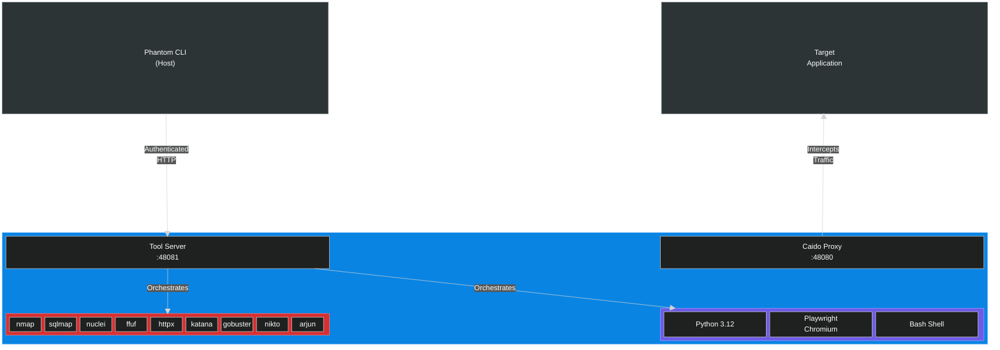

<div align="center">

<br>

# ☠ PHANTOM

### Autonomous Adversary Simulation Platform

> *"Why so Serious!"* — Phantom doesn't ask. It finds.

<br>

[](https://pypi.org/project/phantom-agent/)
[](https://python.org)
[](LICENSE)
[](https://github.com/Usta0x001/Phantom/pkgs/container/phantom-sandbox)

[](#testing)
[](#security-audit)
[](#)
[](#quick-start)

<br>

**AI-powered penetration testing that reasons, adapts, and verifies — like a human red-teamer, but autonomous.**

[Quick Start](#quick-start) · [Architecture](#architecture) · [Usage](#usage) · [Configuration](#configuration) · [Contributing](#contributing)

<br>
</div>

---

## What is Phantom?

Phantom is an autonomous AI penetration testing agent. It uses large language models to discover, exploit, and verify real vulnerabilities in web applications, APIs, and network services — entirely without human intervention.

Unlike signature-based scanners that pattern-match against known CVEs, Phantom **reasons** about your target: it reads responses, forms hypotheses, selects the right tool, chains multi-step exploits, then writes and executes proof-of-concept code to confirm each finding before reporting it.

| | Traditional Scanners | Phantom |
|---|---|---|
| **Approach** | Signature matching | LLM-guided reasoning + tool use |
| **False Positives** | 40–70% typical | Every finding verified with working PoC |
| **Depth** | Single-pass | Multi-phase with chained exploits |
| **Adaptability** | Static rules | Adapts to target responses in real-time |
| **Reports** | Generic dumps | MITRE ATT&CK mapped, compliance-ready |
| **Triage burden** | Hours of manual review | Actionable findings + remediation code |

---

## Proven Results

Tested against **OWASP Juice Shop** (an intentionally vulnerable app):

| Metric | Result |
|--------|--------|
| Vulnerabilities Found | **2 CRITICAL** SQL injections |
| False Positives | **0** |
| Tool Executions | 42 (0 failures) |
| Duration | 17.9 minutes |
| Cost | $0.52 (DeepSeek v3.2) |
| Evidence Quality | Working PoC exploit code for every finding |

Phantom found and verified `POST /rest/user/login` SQL injection (CVSS 9.1) with a complete Python exploit script and admin authentication bypass proof, and `GET /rest/products/search` SQL injection (CVSS 10.0) confirmed by SQLMap — all autonomously.

---

## Core Capabilities

- **Autonomous ReAct Loop** — Plans, executes tools, reads results, adapts strategy. Handles dead ends, tool failures, and unexpected responses without human input.
- **30+ Integrated Security Tools** — nmap, nuclei, sqlmap, ffuf, httpx, katana, nikto, gobuster, arjun, semgrep, playwright, and more.
- **Isolated Docker Sandbox** — All offensive tooling runs in an ephemeral, network-restricted container. Zero host filesystem access. Auto-destroyed after each scan.
- **Multi-Agent Parallelism** — Spawns specialized sub-agents (SQLi specialist, XSS specialist, recon agent) that work in parallel and report back to the coordinator.
- **7-Layer Security Model** — Scope validation, tool firewall, Docker sandbox, cost controller, time limits, HMAC audit trail, output sanitizer.
- **Verified Findings Only** — Every reported vulnerability includes raw HTTP evidence, working exploit code, and reproducible reproduction steps. Phantom never hallucinates.
- **MITRE ATT&CK Enrichment** — Automatic CWE, CAPEC, technique-level tagging, and CVSS 3.1 scoring.
- **Compliance Mapping** — OWASP Top 10 (2021), PCI DSS v4.0, NIST 800-53 — mapped per finding automatically.
- **Knowledge Persistence** — Cross-scan memory stores hosts, past findings, and false positive signatures. Learns from previous scans.
- **Full Cost Control** — Per-request and per-scan budget limits. Every token counted, every dollar tracked in real time.

---

## Architecture

<details open>
<summary><strong>System Overview</strong></summary>


```mermaid
%%{init: {'theme': 'dark', 'themeVariables': {'primaryColor': '#6c5ce7', 'edgeLabelBackground': '#2d3436'}}}%%
flowchart LR
    User(["👤 User / CI"])

    subgraph Interface["Interface"]
        CLI["CLI · TUI"]
        Stream["Output Parser"]
    end

    subgraph Control["Orchestration"]
        Profile["Scan Profiles"]
        Scope["Scope Validator"]
        Cost["Cost Controller"]
        Audit["Audit Logger (HMAC)"]
    end

    subgraph Agent["Agent Core (ReAct)"]
        direction TB
        LLM["LLM · LiteLLM"]
        State["State Machine"]
        Memory["Memory Compressor"]
        Skills["Skills Engine"]
    end

    subgraph Security["Security"]
        Firewall["Tool Firewall"]
        Verifier["Verification Engine"]
        Sanitizer["Output Sanitizer"]
    end

    subgraph Sandbox["Docker Sandbox (Kali)"]
        direction TB
        ToolServer["Tool Server :48081"]
        Tools["30+ Security Tools"]
        Browser["Playwright · Chromium"]
        Proxy["Caido Proxy"]
    end

    subgraph Output["Output"]
        Reports["Reports · JSON/MD/HTML"]
        AttackGraph["Attack Graph"]
        MITRE["MITRE ATT&CK"]
    end

    User --> Interface
    Interface --> Control
    Control --> Agent
    Agent <--> Security
    Security --> Sandbox
    Agent --> Output

    style Interface fill:#6c5ce7,stroke:#a29bfe,color:#fff
    style Control fill:#00b894,stroke:#55efc4,color:#fff
    style Agent fill:#e17055,stroke:#fab1a0,color:#fff
    style Security fill:#d63031,stroke:#ff7675,color:#fff
    style Sandbox fill:#0984e3,stroke:#74b9ff,color:#fff
    style Output fill:#fdcb6e,stroke:#ffeaa7,color:#2d3436
```

</details>

<details>
<summary><strong>Scan Execution Flow</strong></summary>

```mermaid
%%{init: {'theme': 'dark'}}%%
sequenceDiagram
    actor User
    participant CLI as Phantom CLI
    participant Ctrl as Orchestrator
    participant Agent as Agent (ReAct)
    participant FW as Tool Firewall
    participant Box as Docker Sandbox
    participant LLM as LLM Provider
    participant T as Target

    User->>CLI: phantom scan -t https://app.com
    CLI->>Ctrl: Validate scope, init cost controller
    Ctrl->>Box: Spin up ephemeral Kali container
    Ctrl->>Agent: Start with profile + scope

    rect rgba(108, 92, 231, 0.2)
        note over Agent,LLM: Phase 1 — Reconnaissance
        Agent->>LLM: Analyze target, plan recon
        LLM-->>Agent: Run katana, httpx, nmap
        Agent->>FW: Validate tool + arguments
        FW-->>Agent: ✓ Approved
        Agent->>Box: Execute tools
        Box->>T: HTTP probes / port scans
        T-->>Box: Responses
        Box-->>Agent: Endpoints, tech stack, open ports
    end

    rect rgba(214, 48, 49, 0.2)
        note over Agent,LLM: Phase 2 — Exploitation
        Agent->>LLM: Hypothesize attack vectors
        LLM-->>Agent: SQLi on /api/login, XSS on /search
        Agent->>Box: sqlmap / custom payloads
        Box->>T: Injection attempts
        T-->>Box: Vulnerability confirmed
        Box-->>Agent: Raw evidence
    end

    rect rgba(0, 184, 148, 0.2)
        note over Agent,LLM: Phase 3 — Verification
        Agent->>Box: Re-exploit with clean PoC script
        Box->>T: Reproduce attack
        T-->>Box: Confirmed
        Agent->>Agent: Record finding + CVSS score
    end

    Agent->>CLI: Findings (JSON/HTML/MD)
    CLI->>User: ☠ Vulnerabilities + PoCs + Compliance
    CLI->>Box: Destroy container
```

</details>

<details>
<summary><strong>Agent ReAct Decision Loop</strong></summary>


```mermaid
%%{init: {'theme': 'dark'}}%%
stateDiagram-v2
    direction TB
    [*] --> Observe: Scan initialized

    Observe --> Reason: Tool result / LLM response received
    Reason --> Plan: Analyze context, form hypothesis
    Plan --> Act: Select tool + build arguments

    Act --> Firewall: Submit tool call

    Firewall --> Execute: ✓ Validated
    Firewall --> Reason: ✗ Blocked — re-plan

    Execute --> Observe: Results returned

    Observe --> CheckStop: After each iteration
    CheckStop --> Observe: Budget / iterations remain
    CheckStop --> Finalize: Stop condition met

    Finalize --> Verify: Re-test all critical findings
    Verify --> Enrich: Tag MITRE · CWE · CVSS
    Enrich --> Report: Write JSON / MD / HTML
    Report --> [*]: Scan complete ☠
```

</details>

<details>
<summary><strong>Docker Sandbox Internals</strong></summary>


```mermaid
%%{init: {'theme': 'dark'}}%%
block-beta
  columns 3

  CLI["Phantom CLI\n(Host)"]:1
  space:1
  Target["Target\nApplication"]:1

  space:3

  block:container:3
    columns 3
    ToolAPI["Tool Server\n:48081"]:1
    space:1
    Proxy["Caido Proxy\n:48080"]:1

    space:3

    block:tools:1
      nmap
      sqlmap
      nuclei
      ffuf
      httpx
      katana
      gobuster
      nikto
      arjun
    end

    space:1

    block:runtime:1
      Python["Python 3.12"]
      Browser["Playwright\nChromium"]
      Shell["Bash Shell"]
    end
  end

  CLI-- "Authenticated\nHTTP" -->ToolAPI
  Proxy-- "Intercepts\nTraffic" -->Target
  ToolAPI-- "Orchestrates" -->tools
  ToolAPI-- "Orchestrates" -->runtime

  style container fill:#0984e3,stroke:#74b9ff,color:#fff
  style tools fill:#d63031,stroke:#ff7675,color:#fff
  style runtime fill:#6c5ce7,stroke:#a29bfe,color:#fff
  style CLI fill:#2d3436,stroke:#636e72,color:#dfe6e9
  style Target fill:#2d3436,stroke:#636e72,color:#dfe6e9
```

</details>

<details>
<summary><strong>7-Layer Security Model</strong></summary>

```
┌─────────────────────────────────────────────────────────────────┐
│  Layer 1  Scope Validator     Target allowlist, SSRF protection  │
│  Layer 2  Tool Firewall        Arg validation, injection block   │
│  Layer 3  Docker Sandbox       Ephemeral, restricted caps        │
│  Layer 4  Cost Controller      Per-request ($5) + scan ($25)     │
│  Layer 5  Time Limits          Per-tool + global scan timeout     │
│  Layer 6  HMAC Audit Trail     Tamper-evident append-only log    │
│  Layer 7  Output Sanitizer     PII strip, credential redaction   │
└─────────────────────────────────────────────────────────────────┘
```

</details>

---

## Quick Start

**Requirements:** Docker · Python 3.12+ · An LLM API key

```bash
# Install
pip install phantom-agent
# or for isolated install:
pipx install phantom-agent

# Set your LLM
export PHANTOM_LLM="openai/gpt-4o"            # or any LiteLLM-supported model
export LLM_API_KEY="sk-..."

# Run your first scan
phantom scan --target https://your-app.com
```

> First run pulls the sandbox image (~13 GB). This only happens once. Subsequent scans start in seconds.

### Via Docker

```bash
docker run --rm -it \
  -e PHANTOM_LLM="openai/gpt-4o" \
  -e LLM_API_KEY="your-key" \
  -v /var/run/docker.sock:/var/run/docker.sock \
  ghcr.io/usta0x001/phantom:latest \
  scan --target https://your-app.com
```

---

## Usage

```bash
# Quick scan (~15 min) — CI/CD friendly
phantom scan -t https://app.com -m quick

# Standard scan (~45 min) — recommended default
phantom scan -t https://app.com

# Deep scan (1–3 hours) — exhaustive coverage
phantom scan -t https://app.com -m deep

# Stealth — low noise, WAF/IDS evasion
phantom scan -t https://app.com -m stealth

# API-only — REST/GraphQL, no browser
phantom scan -t https://api.app.com -m api_only

# Focus on specific areas
phantom scan -t https://app.com \
  --instruction "Focus on SQL injection and broken authentication in /api/v2"

# Resume an interrupted scan
phantom scan -t https://app.com --resume

# Interactive TUI
phantom -t https://app.com

# Non-interactive (CI/CD pipelines)
phantom scan -t https://app.com --non-interactive

# Set a cost ceiling
PHANTOM_MAX_COST=2.00 phantom scan -t https://app.com
```

### Scan Profiles

| Profile | Max Iterations | Typical Duration | Best For |
|---------|:--------------:|:----------------:|----------|
| `quick` | 50 | ~15 min | CI/CD, rapid checks |
| `standard` | 120 | ~45 min | Regular security testing |
| `deep` | 300 | 1–3 hours | Thorough audits |
| `stealth` | 60 | ~30 min | Production systems, IDS evasion |
| `api_only` | 100 | ~45 min | REST/GraphQL APIs |

### Output

Every scan produces:

```
phantom_runs/<target>_<id>/
├── vulnerabilities/
│   ├── vuln-0001.md        # Full finding with PoC
│   └── vuln-0002.md
├── audit.jsonl             # HMAC-signed event log
├── scan_stats.json         # Cost, tokens, timing
├── enhanced_state.json     # Full scan state
└── vulnerabilities.csv     # Summary index
```

### Post-Scan Pipeline

Every scan automatically runs a 7-stage enrichment pipeline:

```
1. MITRE ATT&CK    CWE, CAPEC, technique-level tagging
2. Compliance       OWASP Top 10 · PCI DSS v4 · NIST 800-53
3. Attack Graph     NetworkX path analysis
4. Nuclei Templates Auto-generated YAML for regression testing
5. Knowledge Store  Persistent cross-scan memory updated
6. Notifications    Webhook / Slack for critical findings
7. Reports          JSON + HTML + Markdown output
```

---

## CI/CD Integration

```yaml
# .github/workflows/security.yml
name: Security Scan

on:
  push:
    branches: [main]
  schedule:
    - cron: '0 2 * * 1'   # Weekly on Monday at 2am

jobs:
  phantom-scan:
    runs-on: ubuntu-latest
    steps:
      - name: Run Phantom scan
        run: |
          pip install phantom-agent
          phantom scan \
            --target ${{ vars.STAGING_URL }} \
            --scan-mode quick \
            --non-interactive \
            --output json
        env:
          PHANTOM_LLM: openai/gpt-4o
          LLM_API_KEY: ${{ secrets.LLM_API_KEY }}
          PHANTOM_MAX_COST: "1.00"
```

---

## Configuration

<details>
<summary><strong>Environment Variables</strong></summary>

| Variable | Description | Default |
|----------|-------------|---------|
| `PHANTOM_LLM` | LLM model identifier (LiteLLM format) | `openai/gpt-4o` |
| `LLM_API_KEY` | API key — comma-separated for key rotation | — |
| `PHANTOM_REASONING_EFFORT` | `low` / `medium` / `high` | `high` |
| `PHANTOM_SCAN_MODE` | Default scan profile | `standard` |
| `PHANTOM_IMAGE` | Sandbox Docker image | `ghcr.io/usta0x001/phantom-sandbox:latest` |
| `PHANTOM_MAX_COST` | Max total cost per scan (USD) | `25.0` |
| `PHANTOM_PER_REQUEST_CEILING` | Max cost per individual LLM request | `5.0` |
| `PHANTOM_WEBHOOK_URL` | Webhook URL for critical finding alerts | — |
| `PHANTOM_DISABLE_BROWSER` | Disable Playwright browser | `false` |
| `PHANTOM_TELEMETRY` | Enable anonymous usage telemetry | `true` |

</details>

<details>
<summary><strong>Supported LLM Providers</strong></summary>

Phantom uses [LiteLLM](https://github.com/BerriAI/litellm) — any of 100+ providers work out of the box:

| Provider | Example Model | Notes |
|----------|--------------|-------|
| **OpenAI** | `openai/gpt-4o` | Best overall quality |
| **Anthropic** | `anthropic/claude-opus-4-5` | Strong multi-step reasoning |
| **Google** | `gemini/gemini-2.5-pro` | Huge context window |
| **Groq** | `groq/llama-3.3-70b-versatile` | Free tier, fast |
| **DeepSeek** | `deepseek/deepseek-chat` | Excellent cost efficiency |
| **OpenRouter** | `openrouter/deepseek/deepseek-v3.2` | Multi-provider routing |
| **Ollama** | `ollama/llama3.1` | Fully local, no API key |
| **Azure OpenAI** | `azure/gpt-4o` | Enterprise deployments |

</details>

---

## Security Audit

Phantom has undergone extensive adversarial auditing across multiple versions:

| Severity | Identified | Fixed |
|----------|:----------:|:-----:|
| Critical | 8 | 8 |
| High | 19 | 19 |
| Medium | 34 | 34 |
| Low | 27 | 27 |
| **Total** | **88** | **88** |

All 88 bugs are resolved. See [CHANGELOG.md](CHANGELOG.md) for full history.

---

## Documentation

| Resource | Description |
|----------|-------------|
| [Architecture](docs/ARCHITECTURE.md) | Deep-dive system design |
| [Documentation](docs/DOCUMENTATION.md) | Full API and configuration reference |
| [Contributing](CONTRIBUTING.md) | Development guidelines |
| [Changelog](CHANGELOG.md) | Version history and release notes |

---

## Contributing

Contributions are welcome. See [CONTRIBUTING.md](CONTRIBUTING.md) for setup instructions.

- **Bugs** → [Open an issue](https://github.com/Usta0x001/Phantom/issues)
- **Features** → [Start a discussion](https://github.com/Usta0x001/Phantom/discussions)
- **PRs** → Fork · branch · test · submit

---

## License

Apache License 2.0 — see [LICENSE](LICENSE).

---

## Acknowledgements

Built on the shoulders of:
[LiteLLM](https://github.com/BerriAI/litellm) · [ProjectDiscovery Nuclei](https://github.com/projectdiscovery/nuclei) · [SQLMap](https://github.com/sqlmapproject/sqlmap) · [Playwright](https://github.com/microsoft/playwright) · [Textual](https://github.com/Textualize/textual) · [Rich](https://github.com/Textualize/rich) · [NetworkX](https://github.com/networkx/networkx) · [ffuf](https://github.com/ffuf/ffuf) · [Caido](https://caido.io)

---

<div align="center">

**☠ PHANTOM** — *Autonomous Adversary Simulation Platform*

Made by [Usta0x001](https://github.com/Usta0x001) · [PyPI](https://pypi.org/project/phantom-agent/) · [Issues](https://github.com/Usta0x001/Phantom/issues)

<br>

> **⚠ Legal Notice:** Only test systems you own or have explicit written authorization to test.
> Unauthorized access to computer systems is illegal under the Computer Fraud and Abuse Act (CFAA)
> and equivalent laws worldwide. The authors assume no liability for misuse.

</div>
