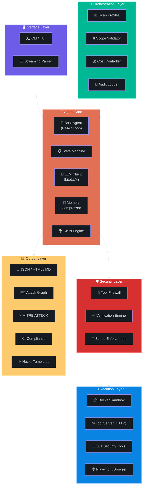
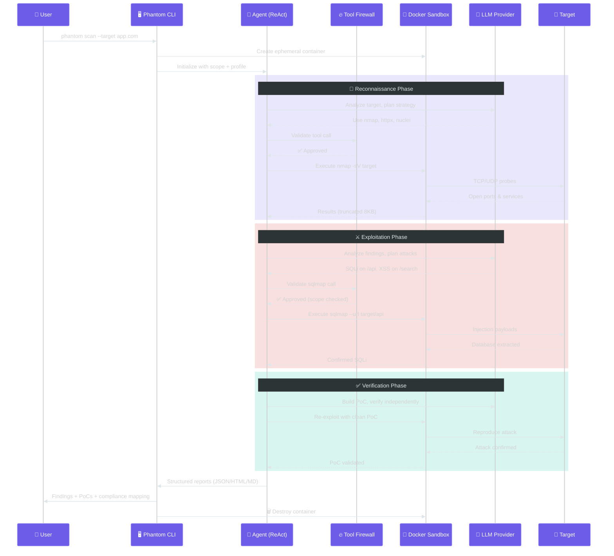
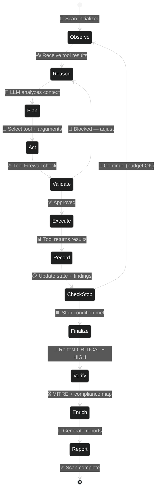
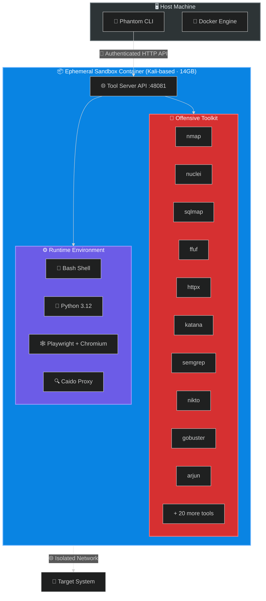
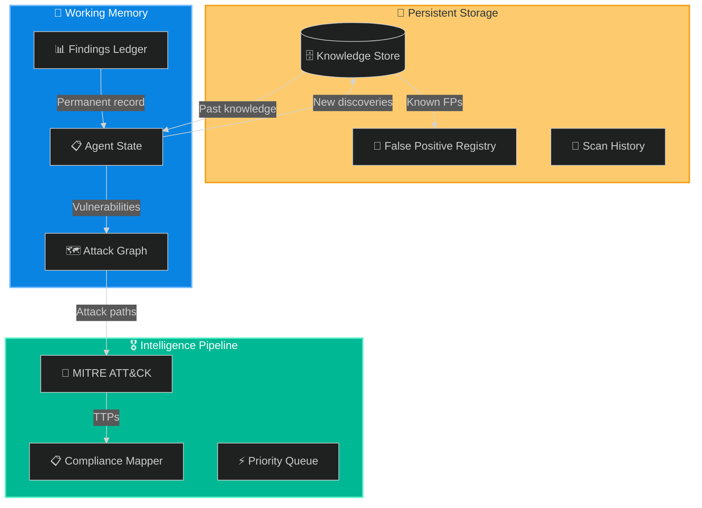
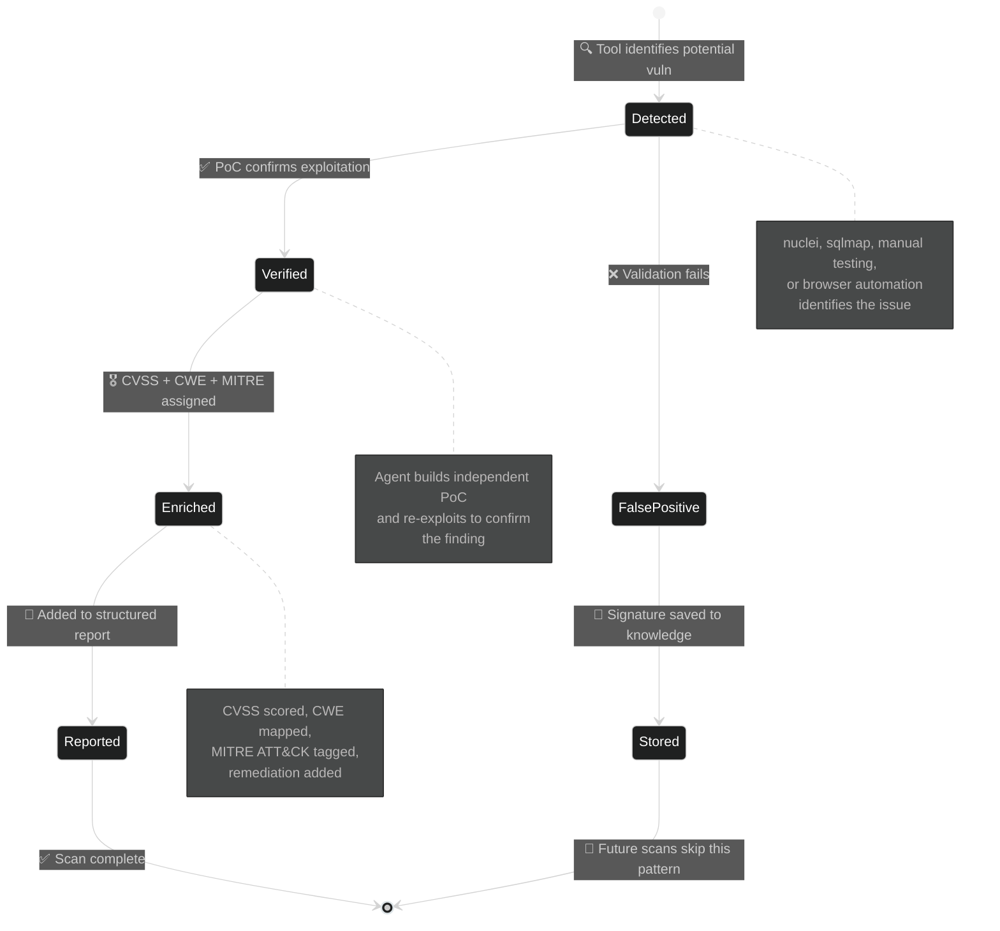
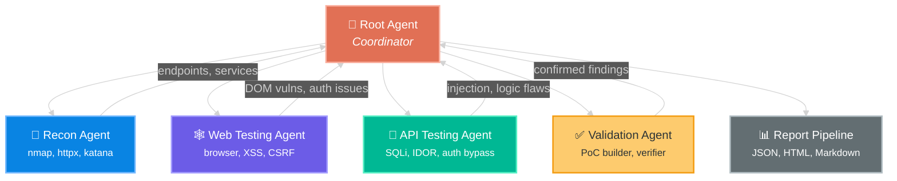

<div align="center">


# 👻 PHANTOM

### 🎯 Autonomous Adversary Simulation Platform

<br>

[](LICENSE)
[](https://python.org)
[](https://hub.docker.com/r/redwan07/phantom)
[](https://pypi.org/project/phantom-agent/)
[](https://github.com/Usta0x001/Phantom/releases)
[](#-testing--quality)
[](#-security-audit)

<br>

**AI-driven penetration testing that reasons, adapts, and verifies like a human red-teamer.**

[⚡ Quick Start](#-quick-start) · [🔬 Features](#-core-capabilities) · [🏗️ Architecture](#-system-architecture) · [📖 Docs](#-documentation) · [🤝 Contributing](#-contributing)

<br>

> **808+ tests passing** · **83-finding security audit — all resolved** · **7-layer defense** · **30+ offensive tools**

</div>

---

## 📋 Table of Contents

- [🌐 Overview](#-overview)
- [🔬 Core Capabilities](#-core-capabilities)
- [🏗️ System Architecture](#-system-architecture)
- [⚡ Quick Start](#-quick-start)
- [🛠️ Usage](#️-usage)
- [⚙️ Configuration](#️-configuration)
- [🔄 CI/CD Integration](#-cicd-integration)
- [💻 Development](#-development)
- [🧪 Testing & Quality](#-testing--quality)
- [📖 Documentation](#-documentation)
- [🤝 Contributing](#-contributing)
- [📜 License](#-license)

---

## 🌐 Overview

Phantom is an **autonomous AI-powered penetration testing agent** that discovers and verifies real vulnerabilities in web applications, APIs, and network services. It uses large language models to reason about targets, plan attack strategies, chain exploits, and adapt based on observed behavior.

Unlike traditional scanners that rely on signatures, Phantom **thinks** — it reads responses, identifies attack surfaces, chains multi-step exploits, and produces working proof-of-concept evidence for every confirmed vulnerability.

> 🎯 **Built for** security professionals, red teams, and developers who need accurate offensive testing at scale.

<br>

<div align="center">

| | Traditional Scanners | 👻 Phantom |
|---|---|---|
| **Approach** | Signature & pattern matching | LLM-guided reasoning with adaptive strategy |
| **Accuracy** | High false positive rate | Every finding verified with a working PoC |
| **Depth** | Single-pass scanning | Multi-phase attack with chained exploits |
| **Reports** | Generic scan dumps | MITRE ATT&CK mapped, compliance-ready |
| **Triage** | Manual review required | Actionable findings + remediation guidance |

</div>

---

## 🔬 Core Capabilities

<table>
<tr>
<td width="50%">

#### 🤖 Autonomous Operation
AI agents that plan, execute, and adapt penetration tests with **zero human intervention**. The ReAct loop drives iterative discovery and exploitation.

#### 🧰 30+ Security Tools
nmap, nuclei, sqlmap, ffuf, httpx, katana, semgrep, nikto, gobuster, arjun, and more — all executing inside an isolated Docker sandbox.

#### 🐳 Sandboxed Execution
All offensive tools run inside **ephemeral Docker containers** — no host filesystem access, restricted capabilities, automatic cleanup.

#### 🧠 Multi-Agent System
Specialized agent delegation for parallel recon, exploitation, and validation. Root agent coordinates; sub-agents specialize.

#### 💰 Cost Tracking
Per-request cost monitoring with budget limits. Every token counted, every dollar tracked.

</td>
<td width="50%">

#### 🔐 7-Layer Security
Scope validator, tool firewall, Docker sandbox, cost controller, time limits, HMAC audit trail, and output sanitizer.

#### 🕸️ Browser Automation
Full Playwright-based interaction for JavaScript-heavy apps, SPAs, and authenticated workflows.

#### 📊 Real Proof-of-Concepts
Every vulnerability includes working exploit code, raw request/response evidence, and reproducible steps.

#### 🗺️ MITRE ATT&CK Mapping
Automatic enrichment with CWE IDs, CAPEC patterns, and MITRE ATT&CK technique tags.

#### 💾 Knowledge Persistence
Cross-scan memory stores discovered hosts, vulnerabilities, and false positive signatures. The agent **learns from past scans**.

</td>
</tr>
</table>

---

## 🏗️ System Architecture

<details open>
<summary><h3>🔭 High-Level Architecture</h3></summary>


```mermaid
%%{init: {'theme': 'dark', 'themeVariables': {'primaryColor': '#6c5ce7', 'primaryTextColor': '#fff', 'primaryBorderColor': '#a29bfe', 'lineColor': '#dfe6e9', 'secondaryColor': '#00b894', 'tertiaryColor': '#2d3436', 'background': '#0d1117', 'mainBkg': '#161b22', 'nodeBorder': '#a29bfe'}}}%%
flowchart TB
    subgraph Interface["🖥️ Interface Layer"]
        direction LR
        CLI["fa:fa-terminal CLI / TUI"]
        Stream["fa:fa-stream Streaming Parser"]
    end

    subgraph Orchestration["⚙️ Orchestration Layer"]
        direction LR
        Profile["📊 Scan Profiles"]
        Scope["🔒 Scope Validator"]
        Cost["💰 Cost Controller"]
        Audit["📝 Audit Logger"]
    end

    subgraph AgentCore["🧠 Agent Core"]
        direction LR
        Agent["🤖 BaseAgent\n(ReAct Loop)"]
        State["📋 State Machine"]
        LLM["🔮 LLM Client\n(LiteLLM)"]
        Memory["🧬 Memory\nCompressor"]
        Skills["📚 Skills Engine"]
    end

    subgraph Security["🛡️ Security Layer"]
        direction LR
        Firewall["🔥 Tool Firewall"]
        Verifier["✅ Verification Engine"]
        ScopeV["🎯 Scope Enforcement"]
    end

    subgraph Execution["🐳 Execution Layer"]
        direction LR
        Docker["📦 Docker Sandbox"]
        ToolServer["🌐 Tool Server (HTTP)"]
        Tools["🧰 30+ Security Tools"]
        Browser["🕸️ Playwright Browser"]
    end

    subgraph Output["📊 Output Layer"]
        direction LR
        Reports["📄 JSON / HTML / MD"]
        Graph["🗺️ Attack Graph"]
        MITRE["🎖️ MITRE ATT&CK"]
        Compliance["📋 Compliance"]
        Nuclei["⚛️ Nuclei Templates"]
    end

    Interface --> AgentCore
    AgentCore --> Security
    Security --> Execution
    AgentCore --> Output
    Orchestration -.-> AgentCore

    style Interface fill:#6c5ce7,stroke:#a29bfe,color:#fff,stroke-width:2px
    style Orchestration fill:#00b894,stroke:#55efc4,color:#fff,stroke-width:2px
    style AgentCore fill:#e17055,stroke:#fab1a0,color:#fff,stroke-width:2px
    style Security fill:#d63031,stroke:#ff7675,color:#fff,stroke-width:2px
    style Execution fill:#0984e3,stroke:#74b9ff,color:#fff,stroke-width:2px
    style Output fill:#fdcb6e,stroke:#ffeaa7,color:#2d3436,stroke-width:2px
```

</details>

<details>
<summary><h3>🔄 Scan Execution Flow</h3></summary>


```mermaid
%%{init: {'theme': 'dark', 'themeVariables': {'actorBkg': '#6c5ce7', 'actorTextColor': '#fff', 'actorBorder': '#a29bfe', 'activationBorderColor': '#a29bfe', 'signalColor': '#dfe6e9', 'labelBoxBkgColor': '#2d3436', 'labelTextColor': '#dfe6e9', 'noteBkgColor': '#2d3436', 'noteTextColor': '#dfe6e9'}}}%%
sequenceDiagram
    participant User as 👤 User
    participant CLI as 🖥️ Phantom CLI
    participant Agent as 🤖 Agent (ReAct)
    participant Firewall as 🔥 Tool Firewall
    participant Sandbox as 🐳 Docker Sandbox
    participant LLM as 🧠 LLM Provider
    participant Target as 🎯 Target

    User->>CLI: phantom scan --target app.com
    CLI->>Sandbox: Create ephemeral container
    CLI->>Agent: Initialize with scope + profile

    rect rgba(108, 92, 231, 0.15)
        Note over Agent,LLM: 🔭 Reconnaissance Phase
        Agent->>LLM: Analyze target, plan strategy
        LLM-->>Agent: Use nmap, httpx, nuclei
        Agent->>Firewall: Validate tool call
        Firewall-->>Agent: ✅ Approved
        Agent->>Sandbox: Execute nmap -sV target
        Sandbox->>Target: TCP/UDP probes
        Target-->>Sandbox: Open ports & services
        Sandbox-->>Agent: Results (truncated 8KB)
    end

    rect rgba(214, 48, 49, 0.15)
        Note over Agent,LLM: ⚔️ Exploitation Phase
        Agent->>LLM: Analyze findings, plan attacks
        LLM-->>Agent: SQLi on /api, XSS on /search
        Agent->>Firewall: Validate sqlmap call
        Firewall-->>Agent: ✅ Approved (scope checked)
        Agent->>Sandbox: Execute sqlmap --url target/api
        Sandbox->>Target: Injection payloads
        Target-->>Sandbox: Database extracted
        Sandbox-->>Agent: Confirmed SQLi
    end

    rect rgba(0, 184, 148, 0.15)
        Note over Agent,LLM: ✅ Verification Phase
        Agent->>LLM: Build PoC, verify independently
        Agent->>Sandbox: Re-exploit with clean PoC
        Sandbox->>Target: Reproduce attack
        Target-->>Sandbox: Attack confirmed
        Sandbox-->>Agent: PoC validated
    end

    Agent->>CLI: Structured reports (JSON/HTML/MD)
    CLI->>User: Findings + PoCs + compliance mapping
    CLI->>Sandbox: 🗑️ Destroy container
```

</details>

<details>
<summary><h3>🧠 Agent Decision Loop (ReAct)</h3></summary>


```mermaid
%%{init: {'theme': 'dark', 'themeVariables': {'primaryColor': '#e17055', 'primaryTextColor': '#fff', 'primaryBorderColor': '#fab1a0', 'lineColor': '#dfe6e9'}}}%%
stateDiagram-v2
    [*] --> Observe: 🚀 Scan initialized
    Observe --> Reason: 📥 Receive tool results
    Reason --> Plan: 🧠 LLM analyzes context
    Plan --> Act: 🎯 Select tool + arguments
    Act --> Validate: 🔥 Tool Firewall check

    Validate --> Execute: ✅ Approved
    Validate --> Reason: 🚫 Blocked — adjust

    Execute --> Record: 📊 Tool returns results
    Record --> CheckStop: 📋 Update state + findings

    CheckStop --> Observe: 🔄 Continue (budget OK)
    CheckStop --> Finalize: ⏹️ Stop condition met

    Finalize --> Verify: 🔬 Re-test CRITICAL + HIGH
    Verify --> Enrich: 🎖️ MITRE + compliance map
    Enrich --> Report: 📄 Generate reports
    Report --> [*]: ✅ Scan complete
```

</details>

<details>
<summary><h3>🐳 Sandbox Architecture</h3></summary>


```mermaid
%%{init: {'theme': 'dark', 'themeVariables': {'primaryColor': '#0984e3', 'primaryTextColor': '#fff'}}}%%
graph TB
    subgraph Host["🖥️ Host Machine"]
        CLI["👻 Phantom CLI"]
        DockerEngine["🐳 Docker Engine"]
    end

    subgraph Container["📦 Ephemeral Sandbox Container (Kali-based · 14GB)"]
        ToolServer["🌐 Tool Server API :48081"]

        subgraph OffensiveTools["🧰 Offensive Toolkit"]
            nmap["nmap"]
            nuclei["nuclei"]
            sqlmap["sqlmap"]
            ffuf["ffuf"]
            httpx["httpx"]
            katana["katana"]
            semgrep["semgrep"]
            nikto["nikto"]
            gobuster["gobuster"]
            arjun["arjun"]
            more["+ 20 more tools"]
        end

        subgraph Runtime["⚙️ Runtime Environment"]
            Shell["🐚 Bash Shell"]
            Python["🐍 Python 3.12"]
            PW["🕸️ Playwright + Chromium"]
            Caido["🔍 Caido Proxy"]
        end
    end

    CLI --> |"🔐 Authenticated HTTP API"| ToolServer
    ToolServer --> OffensiveTools
    ToolServer --> Runtime
    Container -.-> |"🌐 Isolated Network"| Target["🎯 Target System"]

    style Host fill:#2d3436,stroke:#636e72,color:#dfe6e9,stroke-width:2px
    style Container fill:#0984e3,stroke:#74b9ff,color:#fff,stroke-width:2px
    style OffensiveTools fill:#d63031,stroke:#ff7675,color:#fff,stroke-width:2px
    style Runtime fill:#6c5ce7,stroke:#a29bfe,color:#fff,stroke-width:2px
```

</details>

<details>
<summary><h3>💾 Knowledge & Memory System</h3></summary>


```mermaid
%%{init: {'theme': 'dark', 'themeVariables': {'primaryColor': '#fdcb6e', 'primaryTextColor': '#2d3436'}}}%%
graph TB
    subgraph Persistent["💾 Persistent Storage"]
        KS[("🗄️ Knowledge Store")]
        FP["🚫 False Positive Registry"]
        History["📜 Scan History"]
    end

    subgraph Working["🧠 Working Memory"]
        State["📋 Agent State"]
        Ledger["📊 Findings Ledger"]
        Graph["🗺️ Attack Graph"]
    end

    subgraph Intelligence["🎖️ Intelligence Pipeline"]
        MITRE["🏴 MITRE ATT&CK"]
        CompMap["📋 Compliance Mapper"]
        Priority["⚡ Priority Queue"]
    end

    State --> |"New discoveries"| KS
    KS --> |"Past knowledge"| State
    State --> |"Vulnerabilities"| Graph
    Graph --> |"Attack paths"| MITRE
    MITRE --> |"TTPs"| CompMap
    KS --> |"Known FPs"| FP
    Ledger --> |"Permanent record"| State

    style Persistent fill:#fdcb6e,stroke:#f39c12,color:#2d3436,stroke-width:2px
    style Working fill:#0984e3,stroke:#74b9ff,color:#fff,stroke-width:2px
    style Intelligence fill:#00b894,stroke:#55efc4,color:#fff,stroke-width:2px
```

</details>

<details>
<summary><h3>🔬 Vulnerability Lifecycle</h3></summary>


```mermaid
%%{init: {'theme': 'dark', 'themeVariables': {'primaryColor': '#d63031', 'primaryTextColor': '#fff', 'primaryBorderColor': '#ff7675', 'lineColor': '#dfe6e9'}}}%%
stateDiagram-v2
    [*] --> Detected: 🔍 Tool identifies potential vuln
    Detected --> Verified: ✅ PoC confirms exploitation
    Detected --> FalsePositive: ❌ Validation fails

    Verified --> Enriched: 🎖️ CVSS + CWE + MITRE assigned
    Enriched --> Reported: 📄 Added to structured report

    FalsePositive --> Stored: 💾 Signature saved to knowledge
    Stored --> [*]: 🔄 Future scans skip this pattern

    Reported --> [*]: ✅ Scan complete

    note right of Detected
        nuclei, sqlmap, manual testing,
        or browser automation
        identifies the issue
    end note

    note right of Verified
        Agent builds independent PoC
        and re-exploits to confirm
        the finding
    end note

    note right of Enriched
        CVSS scored, CWE mapped,
        MITRE ATT&CK tagged,
        remediation added
    end note
```

</details>

<details>
<summary><h3>🔄 Multi-Agent Coordination</h3></summary>


```mermaid
%%{init: {'theme': 'dark', 'themeVariables': {'primaryColor': '#e17055'}}}%%
graph TB
    Root["🤖 Root Agent<br/><i>Coordinator</i>"]

    Root --> Recon["🔭 Recon Agent<br/><small>nmap, httpx, katana</small>"]
    Root --> WebTest["🕸️ Web Testing Agent<br/><small>browser, XSS, CSRF</small>"]
    Root --> APITest["🔌 API Testing Agent<br/><small>SQLi, IDOR, auth bypass</small>"]
    Root --> Validator["✅ Validation Agent<br/><small>PoC builder, verifier</small>"]

    Recon --> |"endpoints, services"| Root
    WebTest --> |"DOM vulns, auth issues"| Root
    APITest --> |"injection, logic flaws"| Root
    Validator --> |"confirmed findings"| Root

    Root --> Reporter["📊 Report Pipeline<br/><small>JSON, HTML, Markdown</small>"]

    style Root fill:#e17055,stroke:#fab1a0,color:#fff,stroke-width:2px
    style Recon fill:#0984e3,stroke:#74b9ff,color:#fff,stroke-width:2px
    style WebTest fill:#6c5ce7,stroke:#a29bfe,color:#fff,stroke-width:2px
    style APITest fill:#00b894,stroke:#55efc4,color:#fff,stroke-width:2px
    style Validator fill:#fdcb6e,stroke:#f39c12,color:#2d3436,stroke-width:2px
    style Reporter fill:#636e72,stroke:#b2bec3,color:#fff,stroke-width:2px
```

</details>

---

## ⚡ Quick Start

### Prerequisites

| Requirement | Link |
|:-----------:|------|
| 🐳 **Docker** (running) | [Install Docker](https://docs.docker.com/get-docker/) |
| 🐍 **Python 3.12+** | [Install Python](https://python.org) |
| 🔑 **LLM API key** | [OpenAI](https://platform.openai.com/api-keys) · [Anthropic](https://console.anthropic.com/) · [Groq (free)](https://console.groq.com/) · [any LiteLLM provider](https://docs.litellm.ai/docs/providers) |

### Install & Run

```bash
# Install via pipx (recommended)
pipx install phantom-agent

# Configure your LLM
export PHANTOM_LLM="openai/gpt-4o"
export LLM_API_KEY="your-api-key"

# 🚀 Launch your first scan
phantom scan --target https://your-app.com
```

### 🐳 Docker Quick Start

```bash
docker run --rm -it \
  -e PHANTOM_LLM="openai/gpt-4o" \
  -e LLM_API_KEY="your-key" \
  -v /var/run/docker.sock:/var/run/docker.sock \
  ghcr.io/usta0x001/phantom:latest \
  scan --target https://your-app.com
```

> 💡 **First run** automatically pulls the sandbox image (~14GB Kali-based environment with 30+ security tools). Results are saved to `phantom_runs/`.

---

## 🛠️ Usage

### Basic Scans

```bash
# Standard web application scan
phantom scan --target https://your-app.com

# Quick scan (faster, surface-level)
phantom scan --target https://your-app.com --scan-mode quick

# Deep scan (comprehensive, thorough)
phantom scan --target https://your-app.com --scan-mode deep

# Headless mode (for scripts and CI)
phantom scan --target https://your-app.com --non-interactive
```

### 🧪 Advanced Testing

```bash
# Authenticated testing
phantom scan --target https://your-app.com \
  --instruction "Login with admin:password123 then test admin endpoints for IDOR"

# Focused vulnerability hunting
phantom scan --target https://api.your-app.com \
  --instruction "Focus on SQL injection and auth bypass in /api/v2 endpoints"

# Interactive TUI mode
phantom --target https://your-app.com

# Resume an interrupted scan
phantom scan --target https://your-app.com --resume
```

### 📊 Scan Profiles

```bash
phantom profiles   # View all available profiles
```

| Profile | Iterations | Duration | Coverage | Best For |
|:-------:|:----------:|:--------:|:--------:|:--------:|
| `quick` | 20 | 10–20 min | Surface-level recon | CI/CD gates |
| `standard` | 40 | 30–60 min | Balanced depth + speed | Regular testing |
| `deep` | 80 | 1–3 hours | Full attack surface | Comprehensive audit |
| `stealth` | 30 | 20–40 min | Low-noise | Production systems |
| `api_only` | 40 | 30–60 min | API-focused, no browser | REST/GraphQL |

### 🔄 Post-Scan Pipeline

Every scan automatically runs a **7-stage enrichment pipeline**:

```
 ┌─── 1. 🎖️ MITRE ATT&CK ── CWE, CAPEC, OWASP mapping
 ├─── 2. 📋 Compliance ───── OWASP Top 10, PCI DSS, NIST
 ├─── 3. 🗺️ Attack Graph ─── NetworkX path analysis + visualization
 ├─── 4. ⚛️ Nuclei Templates  Auto-generated YAML reproducibility
 ├─── 5. 💾 Knowledge Store ─ Persistent memory updated
 ├─── 6. 🔔 Notifications ── Webhook/Slack for CRITICAL + HIGH
 └─── 7. 📄 Reports ──────── Structured JSON, HTML, Markdown
```

### 🔀 Differential Scanning

```bash
# Compare two scans — see new and fixed vulnerabilities
phantom diff <run1> <run2>
```

---

## ⚙️ Configuration

<details open>
<summary><b>🔧 Environment Variables</b></summary>

| Variable | Description | Default |
|----------|-------------|---------|
| `PHANTOM_LLM` | LLM provider and model | `openai/gpt-4o` |
| `LLM_API_KEY` | API key (comma-separated for rotation) | — |
| `PHANTOM_REASONING_EFFORT` | Thinking depth: `low` / `medium` / `high` | `high` |
| `PHANTOM_SCAN_MODE` | Default scan profile | `standard` |
| `PHANTOM_IMAGE` | Sandbox Docker image | `ghcr.io/usta0x001/phantom-sandbox:latest` |
| `PHANTOM_MAX_COST` | Maximum cost per scan (USD) | `25.0` |
| `PHANTOM_PER_REQUEST_CEILING` | Max cost per LLM request | `5.0` |
| `PHANTOM_WEBHOOK_URL` | Webhook for critical findings | — |
| `PHANTOM_DISABLE_BROWSER` | Disable Playwright | `false` |
| `PERPLEXITY_API_KEY` | Enable web search OSINT | — |

</details>

<details>
<summary><b>🤖 Supported LLM Providers</b></summary>

| Provider | Model Example | Notes |
|:--------:|:------------:|:-----:|
| **OpenAI** | `openai/gpt-4o` | Best overall performance |
| **Anthropic** | `anthropic/claude-sonnet-4-20250514` | Strong reasoning |
| **Google** | `gemini/gemini-2.5-pro` | Large context window |
| **Groq** | `groq/llama-3.3-70b-versatile` | Free tier available |
| **DeepSeek** | `deepseek/deepseek-chat` | Cost-effective |
| **OpenRouter** | `openrouter/deepseek/deepseek-v3.2` | Multi-provider gateway |
| **Ollama** | `ollama/llama3.1` | Local inference, no API key |
| **Azure** | `azure/gpt-4o` | Enterprise deployments |

> 🔗 Phantom uses [LiteLLM](https://github.com/BerriAI/litellm) — any of the [100+ supported providers](https://docs.litellm.ai/docs/providers) work out of the box.

</details>

<details>
<summary><b>💾 Persistent Configuration</b></summary>

```bash
# Save settings
phantom config set PHANTOM_LLM openai/gpt-4o
phantom config set LLM_API_KEY sk-your-key

# View current configuration
phantom config show
```

</details>

---

## 🔄 CI/CD Integration

<details>
<summary><b>🔒 GitHub Actions Example</b></summary>

```yaml
name: 🔒 Security Scan

on:
  pull_request:
    branches: [main]

jobs:
  security-scan:
    runs-on: ubuntu-latest
    steps:
      - uses: actions/checkout@v4

      - name: Install Phantom
        run: pip install phantom-agent

      - name: Run Security Scan
        env:
          PHANTOM_LLM: ${{ secrets.PHANTOM_LLM }}
          LLM_API_KEY: ${{ secrets.LLM_API_KEY }}
        run: phantom scan --target ./ --non-interactive --scan-mode quick

      - name: Upload SARIF
        if: always()
        uses: github/codeql-action/upload-sarif@v3
        with:
          sarif_file: phantom_runs/latest/results.sarif
```

</details>

---

## 💻 Development

```bash
# Clone
git clone https://github.com/Usta0x001/Phantom.git
cd Phantom

# Setup
python -m venv .venv && source .venv/bin/activate  # .venv\Scripts\activate on Windows
pip install -e ".[dev]"

# Test
pytest tests/ -v

# Lint
ruff check phantom/
```

<details>
<summary><b>📁 Project Structure</b></summary>

```
phantom/
├── phantom/                  # 🧠 Core package
│   ├── agents/               #   🤖 AI agent system
│   │   ├── base_agent.py     #     ReAct reasoning loop
│   │   ├── state.py          #     Bounded state machine
│   │   └── enhanced_state.py #     Vulnerability tracking
│   ├── core/                 #   🔒 Security & reporting (20 modules)
│   │   ├── scope_validator.py
│   │   ├── tool_firewall.py
│   │   ├── audit_logger.py
│   │   ├── verification_engine.py
│   │   ├── report_generator.py
│   │   ├── knowledge_store.py
│   │   ├── attack_graph.py
│   │   ├── compliance_mapper.py
│   │   ├── mitre_enrichment.py
│   │   └── nuclei_templates.py
│   ├── tools/                #   🧰 30+ security tool wrappers
│   ├── llm/                  #   🔮 LLM client & memory compression
│   ├── runtime/              #   🐳 Docker sandbox management
│   ├── interface/            #   🖥️ CLI, TUI, streaming
│   ├── models/               #   📋 Pydantic domain models
│   ├── skills/               #   📚 50+ domain knowledge files
│   └── telemetry/            #   📊 Run tracing & statistics
├── tests/                    # 🧪 808+ tests
├── containers/               # 🐳 Sandbox Dockerfile
├── scripts/                  # ⚙️ Build & install scripts
└── docs/                     # 📖 Documentation
```

</details>

---

## 🧪 Testing & Quality

**808+ tests** across 6 test suites with **0 failures**:

| Suite | Tests | Scope |
|:------|:-----:|:------|
| `test_e2e_system.py` | 184 | Full system integration |
| `test_v0920_audit_fixes.py` | 39 | Security fix verification |
| `test_all_modules.py` | ~200 | Module-level unit tests |
| `test_v0918_features.py` | ~100 | Feature regression |
| `test_v0910_coverage.py` | ~80 | Coverage gap tests |
| `test_security_fixes.py` | ~50 | Security-specific tests |

---

## 🛡️ Security Audit

Two deep offensive audits performed on the codebase:

| Metric | Value |
|:-------|:-----:|
| Total findings identified | **83** |
| 🔴 Critical | 8 |
| 🟠 High | 19 |
| 🟡 Medium | 34 |
| 🟢 Low | 22 |
| **Findings resolved** | **83 / 83 (100%)** |
| **System score** | **8.0 / 10** |

---

## 📖 Documentation

| Document | Description |
|:---------|:------------|
| 📐 [Architecture](docs/ARCHITECTURE.md) | System design & technical architecture |
| 📖 [Documentation](docs/DOCUMENTATION.md) | Complete system documentation |
| ⚡ [Quick Start](#-quick-start) | Get scanning in 2 minutes |
| ⚙️ [Configuration](#️-configuration) | Settings, providers, and profiles |
| 🤝 [Contributing](CONTRIBUTING.md) | Development guidelines |

---

## 🤝 Contributing

Contributions are welcome! See the [Contributing Guide](CONTRIBUTING.md) for development setup and guidelines.

- 🐛 **Bug Reports** — [Open an issue](https://github.com/Usta0x001/Phantom/issues)
- 💡 **Feature Requests** — [Start a discussion](https://github.com/Usta0x001/Phantom/discussions)
- 🔀 **Pull Requests** — Fork, branch, test, and submit

---

## 📜 License

Apache License 2.0 — see [LICENSE](LICENSE) for details.

---

## 🙏 Acknowledgements

Phantom builds on these outstanding open-source projects:

[LiteLLM](https://github.com/BerriAI/litellm) · [Nuclei](https://github.com/projectdiscovery/nuclei) · [Playwright](https://github.com/microsoft/playwright) · [Textual](https://github.com/Textualize/textual) · [Rich](https://github.com/Textualize/rich) · [NetworkX](https://github.com/networkx/networkx) · [SQLMap](https://github.com/sqlmapproject/sqlmap)

---

<div align="center">

**👻 PHANTOM** — _Autonomous Adversary Simulation Platform_

Made with 🔥 by [Usta0x001](https://github.com/Usta0x001)

</div>

> ⚠️ **WARNING:** Only test systems you own or have explicit written authorization to test. Unauthorized access to computer systems is illegal. You are fully responsible for ensuring legal and ethical use of this tool.
