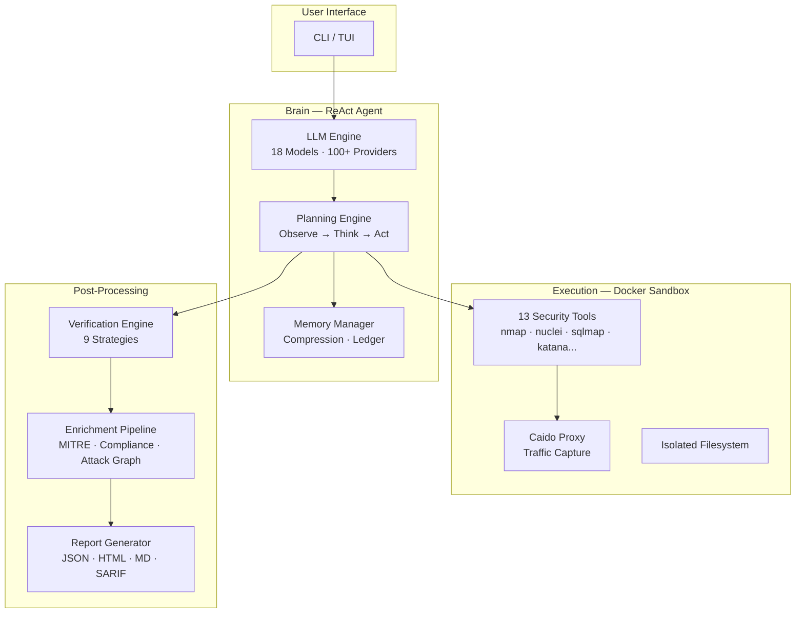
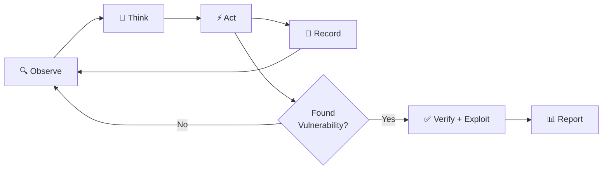
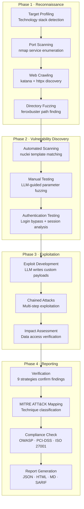
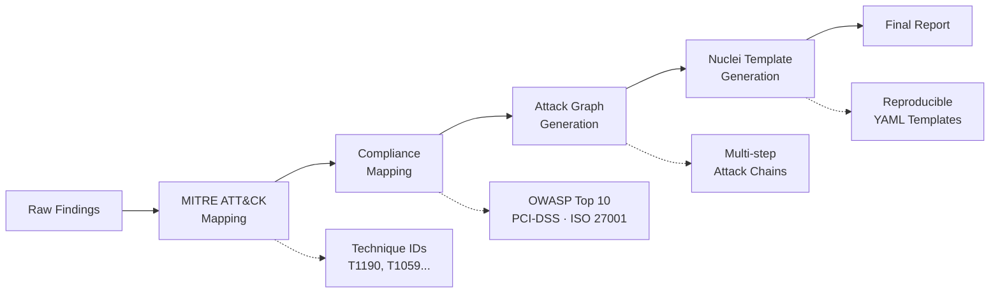
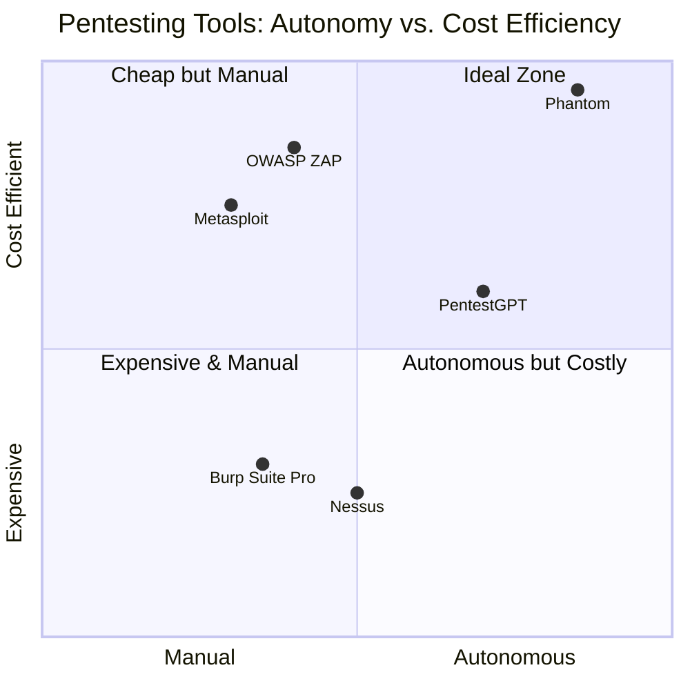
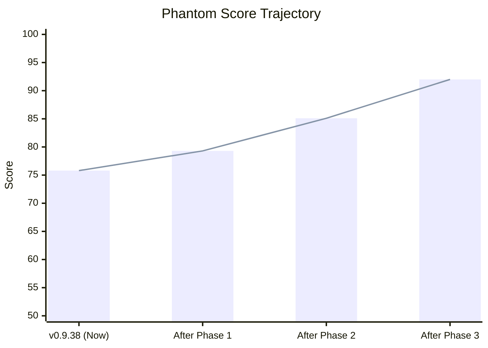

<!-- _class: lead -->

# 👻 Phantom

## Autonomous AI-Powered Penetration Testing Platform

**v0.9.38** · March 2026

Usta0x001

---

# The Problem

## Manual Penetration Testing is Broken

- 🕐 **Slow** — A professional pentest takes 5-15 days per target
- 💸 **Expensive** — Average cost: $10,000 - $50,000 per engagement
- 👤 **Human-dependent** — Skill varies wildly between testers
- 📋 **Inconsistent** — No two pentesters check the same things
- 🔄 **Not repeatable** — Can't re-run the exact same test easily

> **What if an AI agent could autonomously perform penetration tests
> for $0.36 per scan?**

---

# The Solution

## Phantom: End-to-End Autonomous Pentesting

Phantom is an **LLM-powered agent** that autonomously performs complete penetration tests — from reconnaissance to exploitation to report generation.

| Metric | Manual Pentest | Phantom |
|:-------|:--------------:|:-------:|
| **Time** | 5-15 days | 15-45 min |
| **Cost** | $10,000+ | **$0.36** |
| **Repeatability** | Low | 100% |
| **Coverage** | Varies | Systematic |
| **Report** | Manual | Auto-generated |
| **MITRE Mapping** | Sometimes | Always |

---

# Architecture Overview



---

# How It Works — The ReAct Loop



### Agent Reasoning Cycle (up to 300 iterations)

1. **Observe** — Read tool output, analyze responses, check scope
2. **Think** — Reason about attack surface, plan next action
3. **Act** — Execute security tool in sandboxed Docker container
4. **Record** — Log finding, compress memory if needed, update ledger
5. **Verify** — Replay the attack to confirm it's not a false positive
6. **Report** — Generate enriched report with MITRE mapping + PoC

---

# The Scan Pipeline



---

# Security Model — 7 Defense Layers

| # | Layer | Purpose | Implementation |
|:-:|:------|:--------|:---------------|
| 1 | 🐳 **Docker Isolation** | Containment | All tools run inside sandbox container |
| 2 | 🌐 **Scope Validator** | Boundary control | DNS-pinned target whitelist, SSRF protection |
| 3 | 🔐 **HMAC Auth** | API security | Signed tokens for sandbox ↔ host communication |
| 4 | 🧱 **Tool Firewall** | Action filtering | Allowlist of permitted tool commands |
| 5 | 💾 **Resource Limits** | DoS prevention | CPU, memory, network caps on sandbox |
| 6 | 📋 **Audit Logging** | Accountability | Every tool execution logged with timestamps |
| 7 | 🧹 **Orphan Cleanup** | Hygiene | Auto-destroy containers on exit/crash |

> **Defense in Depth**: Even if the LLM tries to escape scope,
> multiple independent layers prevent unauthorized actions.

---

# LLM Integration

## 18 Models Pre-Configured · 100+ Providers via LiteLLM

| Model | Provider | Cost/Scan | Quality |
|:------|:---------|:---------:|:-------:|
| DeepSeek V3.2 | OpenRouter | **$0.36** | ★★★★☆ |
| GPT-4.1 | OpenAI | $2.80 | ★★★★★ |
| Claude 3.5 Sonnet | Anthropic | $3.50 | ★★★★★ |
| Gemini 2.5 Pro | Google | $1.20 | ★★★★☆ |
| Qwen 3 235B | OpenRouter | $0.50 | ★★★★☆ |
| Llama 4 Maverick | OpenRouter | $0.22 | ★★★☆☆ |

### Key Features
- **Automatic cost tracking** — Real-time $/scan displayed
- **35-model benchmark** — Documented in LLM Selection Guide
- **Provider agnostic** — Switch models with one config change
- **Fallback chain** — Auto-switch on provider outage

---

# The Sandbox — 13 Pre-Installed Tools

```
┌─────────────────────────────────────────────────┐
│  Docker Sandbox (12.7 GB)                       │
│                                                 │
│  🔍 Reconnaissance        💉 Exploitation       │
│  ├── nmap                 ├── sqlmap             │
│  ├── httpx                ├── commix             │
│  ├── katana               └── custom payloads    │
│  └── feroxbuster                                 │
│                                                 │
│  🔎 Scanning              🌐 Proxy               │
│  ├── nuclei               └── Caido              │
│  ├── nikto                                       │
│  └── wapiti               📁 Utilities            │
│                           ├── curl               │
│  🔑 Auth Testing          ├── python3            │
│  └── hydra                └── jq                 │
│                                                 │
│  🛡️ Auth: HMAC Token · Resource Limits Applied   │
└─────────────────────────────────────────────────┘
```

---

# Verification Engine — 9 Strategies

The verification engine **re-confirms** each vulnerability by replaying the attack independently.

| Strategy | Vuln Type | Method |
|:---------|:----------|:-------|
| SQL Injection | SQLi | Inject classic payloads, detect error signatures |
| XSS Reflection | Reflected XSS | Inject `<script>` tag, check response body |
| XSS Stored | Stored XSS | Submit payload, visit target page, check persistence |
| Command Injection | RCE/OS Cmd | Inject `; id` / `| whoami`, detect output |
| Path Traversal | LFI | Request `../../etc/passwd`, check for `root:` |
| SSRF Detection | SSRF | Request internal URL, detect response differences |
| SSTI Detection | SSTI | Inject `{{7*7}}`, check for `49` in response |
| Open Redirect | Redirect | Follow redirect chain, check final domain |
| Generic Fallback | Any | Pattern matching + heuristic confidence scoring |

> Each finding is assigned a **confidence score** (0-100%).
> Only verified findings appear in the final report.

---

# Post-Scan Enrichment Pipeline



### What Makes This Special

- **MITRE ATT&CK** — Every finding mapped to technique IDs (T1190, T1059, etc.)
- **Compliance** — Auto-check against OWASP Top 10, PCI-DSS, ISO 27001
- **Attack Graphs** — Visualize multi-step attack chains (SQLi → RCE → Data Exfil)
- **Nuclei Templates** — Auto-generate YAML templates to re-test findings
- **PoC Generation** — Working proof-of-concept for each confirmed vulnerability

---

# Demo Results — OWASP Juice Shop

### Scan Configuration
- **Target:** `http://localhost:3000` (OWASP Juice Shop)
- **Model:** DeepSeek V3.2 via OpenRouter
- **Mode:** Deep scan (300 max iterations)
- **Total Cost:** $0.36

### Findings Summary

| # | Vulnerability | Severity | CVSS | Verified |
|:-:|:-------------|:--------:|:----:|:--------:|
| 1 | SQL Injection (Login Bypass) | 🔴 Critical | 9.8 | ✅ |
| 2 | Stored XSS (Product Review) | 🔴 Critical | 9.1 | ✅ |
| 3 | Broken Auth (Admin Access) | 🟠 High | 8.5 | ✅ |
| 4 | Directory Traversal (File Read) | 🟠 High | 7.5 | ✅ |
| 5 | Sensitive Data Exposure | 🟡 Medium | 6.5 | ✅ |
| 6 | Security Misconfiguration | 🟡 Medium | 5.3 | ✅ |
| 7 | Broken Access Control | 🟡 Medium | 5.0 | ✅ |

> **7 verified vulnerabilities · $0.36 total cost · ~25 minutes**

---

# Output Formats

### JSON Report
```json
{
  "scan_id": "phantom-2026-03-04-abc123",
  "target": "http://localhost:3000",
  "findings": [{
    "title": "SQL Injection - Login Bypass",
    "severity": "critical",
    "cvss": 9.8,
    "mitre_attack": ["T1190"],
    "owasp": "A03:2021 - Injection",
    "poc": "POST /rest/user/login ...",
    "verified": true
  }]
}
```

### Also Available
- **HTML** — Styled report with charts and severity breakdown
- **Markdown** — GitHub-compatible report format
- **SARIF 2.1.0** — For CI/CD integration (GitHub Security tab)

---

# Competitive Analysis



---

# System Audit Results — v0.9.38

### Current Scores by Category

| Category | Score | Status |
|:---------|:-----:|:------:|
| Post-Scan Enrichment | 92/100 | 🟢 Excellent |
| Documentation | 85/100 | 🟢 Very Good |
| Core Scan Engine | 82/100 | 🟢 Good |
| Testing (731 tests, 0 fail) | 80/100 | 🟢 Good |
| Security Hardening | 80/100 | 🟢 Good |
| Memory Management | 78/100 | 🟡 Good |
| LLM Integration | 75/100 | 🟡 Good |
| Sandbox Wiring | 75/100 | 🟡 Good |
| UX / CLI | 72/100 | 🟡 Adequate |
| Reporting | 70/100 | 🟡 Adequate |
| Error Handling | 65/100 | 🟠 Needs Work |
| Verification Engine | 55/100 | 🟠 Needs Work |

### Overall: **75.8 / 100 — Grade: B**

---

# Enhancement Roadmap

### Phase 1: Quick Wins (1-2 weeks) → **B+**

- Wire model fallback into scan loop (prevents scan death on rate limit)
- Add circuit breaker to tool executor (skip broken tools after 3 failures)
- Post-compression token validation (prevent context overflow)
- Fix token leak in `/proc/PID/cmdline`

### Phase 2: Core Improvements (2-4 weeks) → **A-**

- Parallel tool execution (`asyncio.gather()` for recon tools)
- Verification engine POST support + new strategies (IDOR, JWT, CORS)
- PDF report export
- Async memory compression

### Phase 3: Advanced Features (1-3 months) → **A**

- Multi-model routing (cheap model for recon, premium for exploit)
- Web dashboard (real-time monitoring)
- Multi-target scanning
- Plugin/extension system

---

# Score Projection



| State | Score | Grade | Key Improvement |
|:------|:-----:|:-----:|:----------------|
| **v0.9.38 (Current)** | 75.8 | B | Baseline |
| **After Phase 1** | 79.3 | B+ | Robustness + Security |
| **After Phase 2** | 85.1 | A- | Speed + Verification |
| **After Phase 3** | 92.0 | A | Full Feature Set |

---

# Technical Stack

| Layer | Technology |
|:------|:-----------|
| **Language** | Python 3.12+ |
| **LLM Framework** | LiteLLM (100+ providers) |
| **Agent Loop** | Custom ReAct implementation |
| **Sandbox** | Docker (Alpine-based, 12.7 GB) |
| **Proxy** | Caido (traffic capture) |
| **Data Models** | Pydantic v2 |
| **CLI** | Rich + Click |
| **Testing** | pytest (731 tests) |
| **Reports** | JSON, HTML, Markdown, SARIF |
| **Distribution** | PyPI (`pip install phantom-agent`) |
| **Container** | Docker Hub + GHCR |
| **CI/CD** | GitHub Actions |

---

# Key Innovation

## What Makes Phantom Different?

### 1. True Autonomy
Not just a scanner — an **agent that reasons**. It reads output, plans next steps, writes custom exploits, and chains attacks together.

### 2. Cost Revolution
**$0.36 per scan** vs. $10,000+ for manual pentest. Uses efficient models (DeepSeek V3.2) without sacrificing quality.

### 3. Verification-First
Every finding is **independently verified** before reporting. No false positive floods.

### 4. Compliance-Ready
Auto-maps to **MITRE ATT&CK**, **OWASP Top 10**, **PCI-DSS**, and **ISO 27001** — ready for audit submissions.

### 5. Reproducible
Generates **nuclei templates** and **working PoCs** for every finding. Anyone can re-verify.

---

# Quick Start

```bash
# Install
pip install phantom-agent

# Configure
export OPENROUTER_API_KEY="your-key"

# Pull sandbox image
docker pull ghcr.io/usta0x001/phantom-sandbox:latest

# Run a scan
phantom scan http://target.com

# Deep scan with specific model
phantom scan http://target.com --deep --model deepseek/deepseek-chat-v3-0324

# Resume interrupted scan
phantom scan http://target.com --resume
```

---

# Project Stats

| Metric | Value |
|:-------|:------|
| **Version** | 0.9.38 |
| **Python Files** | 124 |
| **Lines of Code** | ~31,890 |
| **Test Count** | 731 (0 failures) |
| **Pre-installed Tools** | 13 |
| **LLM Models Tested** | 35 |
| **Pre-configured Models** | 18 |
| **Output Formats** | 4 (JSON, HTML, MD, SARIF) |
| **Enrichment Modules** | 5 (MITRE, Compliance, Attack Graph, Nuclei, PoC) |
| **Security Layers** | 7 |
| **Verification Strategies** | 9 |
| **Avg. Scan Cost** | $0.36 (DeepSeek V3.2) |
| **License** | MIT |

---

<!-- _class: lead -->

# Thank You

## 👻 Phantom v0.9.38

**GitHub:** [github.com/Usta0x001/Phantom](https://github.com/Usta0x001/Phantom)
**PyPI:** [pypi.org/project/phantom-agent](https://pypi.org/project/phantom-agent/)
**Author:** [Usta0x001](https://github.com/Usta0x001)

> *Autonomous pentesting for everyone — $0.36 at a time.*

---
